# PRD — GRUFARCOL eBR (Registro electrónico de lote, trazabilidad y liberación)

**Versión:** 1.5 · **Fecha:** 08/10/2026 · **Estado:** borrador para confirmar con GRUFARCOL
**Documento hermano (comercial):** `DOCUMENTO_MAESTRO_GRUFARCOL.md` · **Prompts de diseño:** `PROMPTS_CLAUDE_DESIGN_GRUFARCOL.md`
**Lector principal:** el agente de desarrollo con IA (Antigravity, Claude Code, Cursor, Lovable) y quien lo supervisa.

> Regla de lectura para el agente: este documento es la fuente de verdad técnica. Si algo no está aquí, **no lo inventes: pregunta o déjalo en la lista de decisiones abiertas (sección 17)**. Los supuestos S1–S7 del Documento Maestro aplican igual aquí.

---

## 0. Resumen ejecutivo técnico

Aplicación web responsiva (principalmente escritorio, adaptable a tablet de 1024 px) para registrar electrónicamente todo el ciclo de un lote de cosméticos y medicamentos: del brief comercial a la liberación y la trazabilidad. Los datos son **evidencia regulatoria**: las reglas críticas viven en la **base de datos** (restricciones, triggers, funciones SQL), no solo en la interfaz.

Decisiones de arquitectura en una línea cada una:

1. **Monolito modular** Next.js (App Router) + Supabase (Postgres, Auth, Storage, RLS). Sin microservicios.
2. **La base de datos hace cumplir las reglas GxP**: bitácora de auditoría de solo-agregar, bloqueo de registros firmados, segregación de funciones, firma con reautenticación.
3. **Operaciones críticas = funciones SQL (RPC) transaccionales**, nunca varias llamadas sueltas desde el cliente.
4. **Documentos maestros versionados** y congelados en el lote al crearlo.
5. **Perfil regulatorio por línea de producto** (cosmético / medicamento) que enciende o apaga controles.
6. **Validación (CSV) desde el día 1**: requisitos con ID, trazabilidad requisito→prueba, pruebas automatizadas.

## 1. Objetivos, no-objetivos y criterios de éxito

**Objetivos:** (a) un lote completo, de extremo a extremo, sin papel; (b) integridad de datos ALCOA+ demostrable; (c) trazabilidad adelante/atrás/equipo en segundos; (d) expediente final en PDF con QR verificable.

**No-objetivos del MVP:** costeo/contabilidad, planeación de capacidad, programación avanzada de mantenimiento, integración directa con balanzas, logística de despachos, app móvil nativa, modo sin conexión (offline); ejecución del registro de lote **dentro** de la planta de un maquilador (solo se controlan existencias, traslados y recepción del material o producto enviado, ver D-17).

**Criterios de éxito técnico del piloto:** 1 lote liberado de punta a punta; 0 hallazgos de integridad en una prueba de auditoría simulada; todas las pruebas de aceptación (sección 14) en verde; tiempo de respuesta p95 < 800 ms en pantallas de lista con 10.000 filas.

## 2. Usuarios y permisos (RBAC + segregación de funciones)

### 2.1 Roles (códigos técnicos)

| Código | Rol | Código | Rol |
|---|---|---|---|
| `comercial` | Comercial | `lab_aux` | Auxiliar de laboratorio |
| `idi` | Químico formulador (I+D) | `cc_jefe` | Jefe de control de calidad |
| `bodega_aux` | Auxiliar de bodega | `aq_dir` | Director de aseguramiento de calidad |
| `bodega_jefe` | Jefe de bodega | `dt` | Director técnico |
| `prod_aux` | Auxiliar de producción | `admin` | Administrador del sistema |
| `prod_coord` | Coordinador de producción | `auditor` | Auditor invitado (solo lectura, con vencimiento) |
| `master` | Usuario master (edición maestra) | `aq_doc` | Analista de gestión documental (área Aseguramiento de la calidad) |
| `gerencia` | Gerente general (aprueba documentos administrativos, fórmulas y prototipos) | | |

Un usuario puede tener varios roles, **pero la segregación de funciones se evalúa por registro**, no por rol (ver 2.3). Estos 15 roles son los **roles del sistema**; el administrador puede crear **roles adicionales** con los permisos y restricciones de la sección 2.6.

### 2.2 Matriz de permisos (L = leer, C = crear/editar borrador, F = firmar, A = aprobar, — = sin acceso)

| Módulo | comercial | idi | bodega_aux | bodega_jefe | prod_aux | prod_coord | lab_aux | cc_jefe | aq_dir | dt | admin | master | aq_doc | gerencia | auditor |
|---|---|---|---|---|---|---|---|---|---|---|---|---|---|---|---|
| Brief | C F | L | — | — | — | L | — | L | L | L A | — | L | L | L | L |
| Fórmula / Especificación / Instructivo | L | C F | — | — | L | L | L | L F | L A | L A | — | C (versión en borrador) | C (codifica y versiona) | L A | L |
| Prototipos, estabilidad y costos | L | C F | — | — | — | L | C (ensayo) | F | L | L A | — | L | — | L A | L |
| Solicitudes y documentos de la OP (PDF, rótulos, codificado) | — | — | L | L | L | C F | — | L | L A (numeración y revisión) | A | — | L | L | L | L |
| Recepción / Inventario | — | L | C F | L A | L | L | — | L | L | L | — | L | — | L | L |
| Liberación de insumos | — | — | — | L | — | — | C | F A | L | L | — | L | — | L | L |
| Orden de producción | — | — | — | — | L | C F | — | L | L | L | — | L | L | L | L |
| Dispensación / Fabricación / Envase / Acond. | — | — | — | — | C F | F (verifica) | — | L | L | L | — | L | L | L | L |
| Resultados y certificado analítico | — | — | — | — | — | — | C F | F A | L | L | — | L | L | L | L |
| Desviaciones / CAPA | C | C | C | C | C | C | C | C F | A | L A | — | C | C | L | L |
| Liberación final del lote | — | — | — | — | — | L | — | F (revisión calidad) | F (revisión expediente) | **F A (libera)** | — | L | L | L | L |
| Paquete técnico (lista de verificación de expediente) | — | — | — | — | — | F (verifica) | — | — | F (revisa) | F A (aprueba) | — | L | L | L | L |
| Trazabilidad / Auditoría (consulta) | — | L | L | L | L | L | L | L | L | L | L | L | L | L | L |
| Usuarios, catálogos, perfiles | — | — | — | — | — | — | — | — | — | — | C | — | — | — | — |
| Plantillas de proceso (etapas y pasos: despeje de línea, dispensación, fabricación, envase, acondicionamiento y otras) | — | L | — | — | L | L | — | L | A | A | — | C (versión en borrador) | C (codifica) | L | L |
| Bodegas, estantes y ubicaciones | — | — | L | C F | L | L | L | L | A (bodegas externas) | L | C | — | — | L | L |
| Traslados y envíos a bodegas externas | — | — | C | C F A | — | L | — | L | L | L | — | — | — | L | L |
| Sistema de gestión documental (SGD): solicitar, redactar, revisar, aprobar, codificar, publicar y anular documentos | C (autor) | C (autor) | C (autor) | C (autor) F (revisa a su equipo) | C (autor) | C (autor) F (revisa a su equipo) | C (autor) | C (autor) F (revisa) | F A (revisa, aprueba y decide anulaciones) | A (documentos técnicos y administrativos) | — | C (autor) | **C F (estandariza, codifica, publica y custodia)** | A (documentos administrativos) | L |
| Lectura y capacitación (leer, presentar cuestionario y obtener constancia) | F (lee) | F (lee) | F (lee) | F (lee) | F (lee) | F (lee) | F (lee) | F (lee) | F (lee) | F (lee) | — | F (lee) | C (asigna y hace seguimiento) | F (lee) | L |

La matriz anterior es la **línea base** de los roles del sistema y es de solo lectura en la plataforma (cambiarla es un cambio de este PRD). Los roles adicionales (2.6) agregan columnas configurables.

### 2.3 Reglas de segregación de funciones (SOD) — obligatorias en base de datos

| ID | Regla | Error al violarla |
|---|---|---|
| SOD-1 | Quien **ejecuta** un paso no puede **verificarlo** | `SOD_VIOLATION` |
| SOD-2 | Quien verifica no puede **aprobar** el mismo registro | `SOD_VIOLATION` |
| SOD-3 | Quien crea una versión de fórmula/instructivo no la aprueba | `SOD_VIOLATION` |
| SOD-4 | Quien dispensa no verifica la dispensación del mismo ítem (perfil medicamento) | `SOD_VIOLATION` |
| SOD-5 | Quien analiza no aprueba el certificado de ese lote | `SOD_VIOLATION` |
| SOD-6 | Quien libera el lote (`dt`) no pudo haber ejecutado pasos de ese lote | `SOD_VIOLATION` |
| SOD-7 | `admin` no puede firmar registros de calidad | `FORBIDDEN_ROLE` |
| SOD-8 | Quien **elabora o modifica** un documento controlado (autor, incluido `master`) no puede revisarlo ni aprobarlo. **Quien lo revisa sí puede aprobarlo** (regla del procedimiento de elaboración de documentos) | `SOD_VIOLATION` |
| SOD-9 | `master` y `aq_doc` no firman registros de ejecución de lote (dispensación, fabricación, envase, acondicionamiento) | `FORBIDDEN_ROLE` |
| SOD-10 | Una versión aprobada o vigente no se edita: cualquier cambio crea una **versión nueva en borrador** | `RECORD_LOCKED` |

### 2.4 Usuario master (edición maestra)

El `master` es el usuario autorizado para **crear y modificar los documentos maestros y las plantillas de proceso** sin depender de otro rol de autoría:

- **Qué puede crear o cambiar:** fórmulas, especificaciones, instructivos y las **plantillas de cada etapa del proceso**: despeje de línea, dispensación, fabricación, envase, acondicionamiento y otras («entre otros») que se definan en el catálogo de etapas (`stage_definitions`): pasos, parámetros a registrar, rangos, equipos exigidos y verificación requerida.
- **Cómo lo hace (sin romper GxP):** siempre mediante una **versión nueva en estado borrador** (SOD-10). Esa versión sigue el flujo de revisión y aprobación del SGD (2.5); el master **no puede aprobar lo que él mismo creó** (SOD-8) ni modificar versiones aprobadas ni registros de lote ya ejecutados (`RECORD_LOCKED`). Cada cambio exige **motivo** y queda en la bitácora.
- **Qué no puede hacer:** firmar registros de ejecución (SOD-9), liberar insumos o lotes, ni administrar usuarios (eso es del `admin`; ver decisión D-18 sobre si ambos roles los ocupa la misma persona).
- **Efecto sobre lotes:** un lote ya creado conserva las versiones congeladas (DI-8); la versión nueva aplica a los lotes que se creen después de quedar **vigente**.
- **Pantallas:** S-07, S-08 y S-09 (con acceso de edición), y S-43 (plantillas de proceso).

### 2.5 Aseguramiento de la calidad y sistema de gestión documental (SGD)

**Fuente.** Esta sección aplica el *Procedimiento para la elaboración de documentos* y el *Procedimiento para el registro y control de documentos* aportados por el usuario como referencia de buenas prácticas. Se tomaron sus **reglas** (codificación, estructura, vigencias, roles, flujos) y se **quitaron** los nombres de empresa, de personas y los códigos propios, que GRUFARCOL debe definir (decisión D-15). Todo lo que sigue es **configurable** en `document_types`, `approval_routes` y `retention_rules`.

**Aseguramiento de la calidad (AQ)** es un área con tres roles en el SGD: `aq_doc` (analista de gestión documental), `aq_dir` (director o jefe) y los autores de las demás áreas. Alcance: el sistema de gestión de la calidad. La gestión de seguridad y salud en el trabajo (documentada con otra codificación en la referencia) queda **fuera del MVP**.

#### 2.5.1 Estructura documental y tipos

Cinco niveles: **1 Normatividad · 2 Manuales · 3 Procedimientos · 4 Instructivos, técnicas y matrices · 5 Formatos**. Tipos (sigla): Manual `MN`, Plan `PL`, Procedimiento `PR`, Formato `FR`, Política `PO`, Programa `PG`, Especificación `EP`, Registro `RG`, Certificado `CE`, Instructivo `IN`, Ficha técnica `FT`, y **Protocolo `PC`** (estudios como la estabilidad, validaciones o mapeo de temperatura; sigla propuesta). Un **formato** es el documento en blanco; un **registro** es el formato diligenciado: en la plataforma, el registro de lote es la instancia de un formato.

**Documentos externos** (contratos, catálogos, normas obligatorias, resoluciones): se registran con su emisor y su versión, sin firmas internas, pero con **control de su distribución**.

#### 2.5.2 Codificación (la asigna solo `aq_doc`)

`PPP-TT-NNN` — proceso (3 caracteres), tipo (2) y consecutivo `001`–`999` por tipo y proceso. Subdocumentos (formato, instructivo o registro de un procedimiento): `PPP-TT-NNN-LL-##`. Ejemplos neutros: `GCA-PR-001` (procedimiento del proceso de calidad) y `PRD-PR-003-FR-01` (formato 01 del procedimiento PRD-PR-003). El título **empieza por el nombre del tipo** («Procedimiento para…», «Instructivo de…»). Siglas de proceso propuestas: `GCA`, `ADM`, `CC`, `PRD`, `MTO`, `TH`, `GLG` (almacenamiento y logística) e `IDI` (I+D, propuesta).

#### 2.5.3 Contenido, encabezado y pie

- **Encabezado:** logotipo, título, **fecha de emisión** (`dd-mm-aaaa`), **fecha de revisión**, **versión** (inicia en `01`), **código** y paginación «página x de y».
- **Cuerpo mínimo:** Objetivo · Alcance (los formatos e instructivos no llevan alcance) · Responsables · Desarrollo del documento · Documentos relacionados y anexos · Control de cambios.
- **Pie:** **historial de actualizaciones** (versión, fecha, descripción; el PDF muestra los últimos tres) y **cuadro de firmas** (*Actualizado por · Revisado por · Aprobado por*, con nombre, cargo, firma corta y fecha). En los formatos e instructivos que se distribuyen, el cuadro y el historial solo van en la copia de Aseguramiento de la calidad.
- **Redacción:** clara, en **infinitivo**, con terminología uniforme y **sin términos subjetivos** («suficientemente», «generalmente», «adecuadamente», «apropiadamente»); unidades del **Sistema Internacional**; «N.A.» cuando no aplica. La plataforma incluye un **revisor de redacción** que marca estos casos (S-49).

#### 2.5.4 Roles y rutas de aprobación (por defecto)

| Paso | Quién | Regla |
|---|---|---|
| Solicitar y redactar el preliminar | Cualquier usuario (o el responsable del proceso), con la plantilla editable que entrega el sistema | El autor no revisa ni aprueba su documento (SOD-8) |
| Estandarizar, codificar, actualizar el listado maestro | `aq_doc` | Solo `aq_doc` asigna códigos; si no cumple, se devuelve al solicitante |
| Revisar | Jefe inmediato del autor o `aq_dir` | **El revisor sí puede aprobar** (`allow_reviewer_as_approver`) |
| Aprobar | `dt` (documentos técnicos); `gerencia` o `dt` (administrativos) | Firma con reautenticación |
| Publicar, emitir copias controladas, archivar el original | `aq_doc` | La versión anterior pasa a obsoleta |
| Divulgar | Quien elaboró, revisó o aprobó, o `aq_doc` | Ver 2.5.7 |
| Decidir una anulación | `aq_dir` | Ver 2.5.6 |

#### 2.5.5 Flujo de creación o modificación

```
solicitud (correo → solicitud en el sistema) → plantilla editable al solicitante
→ preliminar → estandarización por aq_doc (¿cumple? no → vuelve al solicitante)
→ asignación de código + listado maestro actualizado → revisión → aprobación
→ vigente: original archivado + copias controladas a los procesos indicados → divulgación
```

**Cambio de versión.** Toda modificación se informa a Aseguramiento de la calidad y diligencia el **control de cambios** del documento; cuando un **formato cambia en información técnica**, el procedimiento asociado también debe revisarse (`PARENT_DOCUMENT_REVIEW_REQUIRED`).

#### 2.5.6 Anulación

El jefe de área solicita la eliminación → `aq_dir` analiza si es viable → si es afirmativa, se **recogen las copias** de cada proceso donde se distribuyó (`document_recalls`) → se marca **OBSOLETO** (sello y marca de agua, digital y físico) → se archiva → se actualiza el listado maestro.

#### 2.5.7 Distribución, copias, divulgación y capacitación

- **Copia controlada:** copia del original aprobado, con sello, para personal autorizado dentro del sistema. **Copia no controlada:** entregada a un tercero con fines informativos. El sello denota la originalidad y el control documental. Los formatos no requieren sello de copia controlada (configurable: `stamp_required`, D-22).
- **Control de documentos:** cada entrega de documento aprobado y cada recolección de obsoleto queda registrada (`document_distribution`).
- **Divulgación:** por plataforma de capacitación; la evidencia es la **constancia** que se obtiene al presentar el cuestionario con **80 % o más** (`pass_score` configurable) y el registro de capacitación y entrenamiento. El módulo S-47 reemplaza o se integra con la plataforma que use GRUFARCOL (D-21).

#### 2.5.8 Vigencia, revisión y disposición final

| Clase de documento | Regla de vigencia / revisión |
|---|---|
| Manuales, procedimientos, instructivos, formatos y anexos | Se revisan cada **3 años** |
| Fórmula maestra, artes, instructivos de manufactura, fichas técnicas, material de envase y empaque | Vigencia = **la del registro sanitario**; al renovarse o cambiar, se actualizan (`validity_rule = registro_sanitario`) |
| Especificaciones de materia prima y producto terminado | Revisión **anual**; la especificación de producto toma además la vigencia del registro sanitario |
| Técnicas analíticas de desarrollo interno | Vigencia de la **validación** de la técnica |
| Documentos obsoletos archivados | Se conservan **5 años** (la última versión obsoleta, en físico y digital) |
| Expedientes de notificación sanitaria o registro sanitario | **5 años** después de cancelado o vencido el registro |
| Documentación de equipos | Hasta el **fin de la vida útil** del equipo |

**Indicador anual:** *% de documentos vencidos por proceso* = documentos vencidos ÷ total de documentos × 100, visible en el tablero de AQ.

#### 2.5.9 Listado maestro y trazabilidad

El **listado maestro** es una vista (`v_master_list`) exportable a Excel que se actualiza sola; las actividades documentales se trazan por código y por documentos asociados (padre ↔ subdocumentos).

#### 2.5.10 Cómo se mantiene el SGD «corriendo» con el registro de lote (el corazón del producto)

1. **Los formatos del lote son documentos controlados.** Cada registro (despeje, dispensación, fabricación, envase, acondicionamiento, control de peso, inspección, certificado, consolidado, paquete técnico…) es la instancia de un formato con código `PPP-PR-NNN-FR-##` y versión; la pantalla y el PDF muestran el encabezado (código, versión, fecha de emisión, fecha de revisión, página x de y).
2. **El lote congela código y versión** de cada documento que usa (`batches.frozen_document_versions`).
3. **Solo documentos `vigente`** en lotes nuevos (`DOCUMENT_NOT_EFFECTIVE`); un formato con **revisión vencida** genera alerta y, según configuración (D-26), puede bloquear la creación de órdenes.
4. **Fórmulas, especificaciones, instructivos de manufactura, protocolos de estabilidad y plantillas de proceso** son documentos controlados con la vigencia de 2.5.8 (p. ej. la fórmula y el instructivo vencen con el registro sanitario del producto).
5. **Control de cambios conectado con calidad:** una desviación, una CAPA, una auditoría o la renovación del registro sanitario pueden abrir una **solicitud de cambio documental**; se cierra cuando la versión nueva queda vigente.
6. **Capacitación:** antes de ejecutar pasos regidos por una versión vigente, el usuario debe haber aprobado su cuestionario o confirmado lectura (`TRAINING_REQUIRED`, D-19).
7. **Copias:** todo PDF lleva «Copia controlada» o «Copia no controlada» y los obsoletos, «OBSOLETO».

#### 2.5.11 Buenas prácticas de diligenciamiento reflejadas en el eBR

Información puntual, exacta, consistente y libre de falsificación (ALCOA+); fechas `dd-mm-aaaa`; hora de 24 h; **firma corta** registrada (DI-11); «N.A.» cuando no aplica; **no hay tachones ni enmiendas**: una corrección conserva el valor anterior tachado, con asterisco, firma corta, fecha y motivo, y **más de 5 correcciones en un mismo registro generan aviso** (DI-12); unidades del SI.

### 2.6 Roles configurables (roles adicionales)

El administrador puede **crear, configurar y retirar roles adicionales** desde *Catálogos y configuración* (S-04) para cubrir cargos que no encajan en los 15 roles del sistema (D-06). Reglas:

| Tema | Regla |
|---|---|
| Qué se configura | Código (minúsculas, único), nombre, descripción; **permisos por módulo** de la matriz 2.2 (L, C, F, A en cada uno de los 19 módulos); roles **incompatibles** (no puede tenerlos la misma persona); si el rol **exige fecha de vencimiento** al asignarlo (como `auditor`) y si es **de solo lectura** (solo L) |
| Funciones reservadas (no se pueden dar a un rol adicional) | Administrar usuarios, catálogos y perfiles (exclusivo de `admin`); **aprobar la liberación final del lote** (exclusivo de `dt`, PRD 2.2); **codificar y crear documentos controlados** (exclusivo de `aq_doc`, RF-93) |
| Segregación de funciones | SOD-1…SOD-10 aplican a todo rol por igual (se evalúan por registro, 2.3) |
| Roles del sistema | Los 15 roles de 2.1 no se retiran y sus permisos son de solo lectura (línea base del PRD) |
| Retiro («eliminar») | Nada se borra: un rol se **retira** (deja de poder asignarse y de dar permisos) solo si ningún usuario lo tiene asignado y vigente; su historial y la bitácora se conservan. Un rol retirado puede reactivarse |
| Trazabilidad | Toda creación, cambio de permiso, incompatibilidad o retiro exige **motivo** y queda en la bitácora con antes/después y versión del rol. Si la creación de roles requiere además aprobación de Aseguramiento de la calidad se define en D-39 |

## 3. Arquitectura

```
Navegador (Next.js, React Server Components + componentes cliente)
   │  HTTPS
   ▼
Next.js (Route Handlers / Server Actions)  ──►  Supabase
   • validación Zod                              • Auth (usuarios, sesiones)
   • generación PDF/QR (servidor)                • Postgres (RLS + triggers + RPC)
   • lectura/escritura vía RPC                   • Storage (adjuntos, PDFs, certificados)
```

Principios para el agente:

- **Nunca** pases la clave `service_role` al navegador. Úsala solo en el servidor y solo para tareas administrativas puntuales.
- Toda mutación crítica pasa por una **función SQL** `SECURITY DEFINER` que valida rol, estado y SOD, escribe el registro y la bitácora **en una sola transacción**.
- El cliente nunca decide la hora: `now()` del servidor. Zona horaria de presentación `America/Bogota`; se guarda en UTC (`timestamptz`).
- Lecturas masivas: vistas SQL (`v_*`) con RLS; nada de filtrar permisos en el cliente.

## 4. Pila tecnológica y dependencias

Fijar versiones exactas al instalar (`package.json` sin `^`) y registrarlas en `docs/VERSIONES.md`.

| Capa | Herramienta | Para qué |
|---|---|---|
| Framework | Next.js (App Router) + TypeScript estricto | Interfaz y servidor |
| Estilos | Tailwind CSS + shadcn/ui + lucide-react | Sistema de diseño (tokens de `PROMPTS…` Prompt 0) |
| Datos | Supabase (Postgres 15+), Supabase CLI | Base, Auth, Storage, migraciones |
| Tipos | `supabase gen types typescript` | Tipos TS desde el esquema |
| Formularios | react-hook-form + Zod | Validación cliente y servidor |
| Tablas | TanStack Table | Listas con filtros y paginación |
| Fechas | date-fns (+ locale `es`) | Formatos es-CO |
| PDF | @react-pdf/renderer | Expediente y certificados |
| QR | qrcode | Rótulos y verificación |
| Hash | `crypto` de Node (SHA-256) | Huella de PDF y de registros firmados |
| Pruebas | Vitest, Playwright, pgTAP | Unitarias, E2E, base de datos |
| Calidad de código | ESLint, Prettier, `tsc --noEmit`, husky | Puerta previa a commit |

**Hosting:** Supabase en la nube **o autoalojado** (decisión D-02, mitiga residencia de datos). El esquema no depende de funciones propietarias exclusivas de la nube.

## 5. Estructura del repositorio

```
/supabase
  /migrations        # SQL numerado: 0001_extensions.sql, 0002_core.sql, ...
  /tests             # pgTAP
  seed.sql           # datos ficticios (los del Prompt 0B)
/src
  /app               # rutas (ver sección 12)
  /components/ui     # shadcn
  /components/gxp    # SignatureModal, StatusBadge, AuditTrailPanel, CorrectionDialog, SodNotice
  /lib/db            # cliente Supabase, tipos generados
  /lib/rpc           # envoltorios tipados de funciones SQL
  /lib/pdf           # plantillas PDF
  /lib/format.ts     # COP, fechas, números es-CO
/docs
  PRD_GRUFARCOL.md  DOCUMENTO_MAESTRO_GRUFARCOL.md  VERSIONES.md  VALIDACION/
/e2e                 # Playwright
AGENTS.md            # reglas del agente (sección 15)
```

## 6. Modelo de datos

### 6.1 Convenciones

- Claves `uuid` (`gen_random_uuid()`); códigos legibles aparte (`OP-2026-0001`, `LOT-…`).
- Todas las tablas: `id`, `created_at`, `created_by`, `updated_at`, `updated_by`. Tablas firmables: además `status`, `locked_at`.
- **Nada se borra**: `deleted_at` solo en catálogos; en registros de lote prohibido (trigger).
- Cantidades: `numeric(14,4)` + `unit` explícita. Dinero: `numeric(14,2)` COP.
- Todas las tablas con RLS activado desde su creación.

### 6.2 Diagrama entidad-relación (núcleo)

```mermaid
erDiagram
  profiles ||--o{ user_roles : tiene
  product_lines ||--o{ products : agrupa
  products ||--o{ briefs : origina
  products ||--o{ formulas : tiene
  formulas ||--o{ formula_items : contiene
  materials ||--o{ formula_items : usa
  products ||--o{ specifications : tiene
  products ||--o{ instructions : tiene
  instructions ||--o{ instruction_steps : contiene
  materials ||--o{ material_lots : recibe
  material_lots ||--o{ lot_status_history : historia
  products ||--o{ production_orders : programa
  production_orders ||--|| batches : genera
  batches ||--o{ stage_orders : divide
  stage_orders ||--o{ step_records : registra
  batches ||--o{ dispensing_requests : pide
  dispensing_requests ||--o{ dispensing_lines : detalla
  dispensing_lines ||--o{ dispensing_line_lots : "varios lotes"
  material_lots ||--o{ dispensing_line_lots : consume
  equipment ||--o{ equipment_events : "hoja de vida"
  equipment ||--o{ step_equipment : usado_en
  step_records ||--o{ step_equipment : usa
  batches ||--o{ deviations : afecta
  deviations ||--o{ capa_actions : genera
  batches ||--o{ lab_results : analiza
  batches ||--o{ batch_releases : libera
  batch_releases ||--o{ release_documents : emite
  briefs ||--o{ brief_competitors : compara
  briefs ||--o{ formula_prototypes : origina
  formula_prototypes ||--o{ stability_studies : ensayo
  stability_studies ||--o{ stability_tests : contiene
  stability_tests ||--o{ stability_readings : mide
  warehouses ||--o{ racks : contiene
  racks ||--o{ storage_locations : genera
  storage_locations ||--o{ stock_by_location : guarda
  material_lots ||--o{ stock_by_location : "saldo por ubicación"
  external_parties ||--o{ warehouses : "bodega externa"
  warehouses ||--o{ stock_transfers : origen_destino
  stock_transfers ||--o{ stock_transfer_lines : detalla
  organizational_areas ||--o{ controlled_documents : "es dueña"
  document_types ||--o{ controlled_documents : clasifica
  controlled_documents ||--o{ document_versions : versiona
  document_versions ||--o{ document_reads : "lectura"
  document_versions ||--o{ document_distribution : distribuye
  controlled_documents ||--o{ document_change_requests : "cambio"
  stage_definitions ||--o{ process_templates : plantilla
  process_templates ||--o{ process_template_steps : pasos
  formula_prototypes ||--o| formulas : "se aprueba como"
  formulas ||--o{ cost_sheets : costea
  production_orders ||--o{ material_requests : genera
  material_requests ||--o{ material_request_lines : detalla
  material_requests ||--o{ material_returns : devuelve
  batches ||--o{ coding_orders : codifica
  stage_orders ||--o{ cleaning_records : limpieza
  batches ||--o| tech_package_checklists : expediente
  signatures }o--|| profiles : firma
  audit_log }o--|| profiles : actor
```



### 6.3 Diccionario de tablas (campos clave)

**Identidad y configuración**

| Tabla | Campos clave |
|---|---|
| `profiles` | id (= auth.users.id), full_name, document_id, active, signature_pin_set |
| `user_roles` | user_id, role (enum), granted_by, granted_at, expires_at |
| `product_lines` | code, name, regulatory_profile (`cosmetico`/`medicamento`) |
| `regulatory_profiles` | profile, rule_key, enabled, params (jsonb) — p. ej. `independent_verification`, `critical_deviation_blocks_release` |
| `brands` | name, active (solo si maquila, supuesto S3) |
| `guest_access` | user_id, granted_by, expires_at, scope |
| `organizational_areas` | code, name, **process_code** (sigla de 3 caracteres usada en los códigos de documento; propuesta: `GCA` garantía/aseguramiento de la calidad, `ADM` administrativo, `CC` control de calidad, `PRD` producción, `MTO` mantenimiento, `TH` talento humano, `GLG` gestión logística y almacenamiento, `IDI` I+D), head_user_id; el usuario pertenece a un área (`profiles.area_id`) |
| `signature_registry` | user_id, short_signature (p. ej. `L. Torres`), specimen_file?, registered_at — registro de firmas |
| `retention_rules` | record_class (`documento_obsoleto/expediente_registro_sanitario/equipo/registro_de_lote/otro`), years, basis (`desde_obsolescencia/desde_vencimiento_registro/vida_util_equipo`) |
| `stage_definitions` | code (`despeje/dispensacion/fabricacion/envase/acondicionamiento/…`), name, order_no, requires_clearance, requires_cleaning_record, governing_document_id, active — catálogo de etapas editable por `master` en versiones |

**Maestros y documentos versionados**

| Tabla | Campos clave |
|---|---|
| `products` | code, name, line_id, brand_id?, presentation_list |
| `briefs` | code, execution_date, project_name, project_type (`innovador/nuevo_portafolio/modificacion_renovacion/extension_linea/maquila_tercero`), product_category (`cosmetico/medicamento`), justification, sources_description, target (jsonb: estrato, rango_edad, sexo, ingresos, otras, para_quien, psicograficos, actitud_compra, frecuencia_consumo), channels (array: `cadenas/subtiendas/mercado_tradicional/otros`), margin_pct, suggested_price_by_presentation (jsonb), legal_requirements, implementation_costs, recommendations, status, version |
| `brief_competitors` | brief_id, manufacturer, product_name, container (vidrio/PET/otro), cap_type, label_type, claims, actives, price, price_per_ml, aroma, color, appearance |
| `materials` | code, name, type (`mp`/`envase`/`empaque`), unit, spec_id?, requires_coa |
| `formulas` | product_id, version, status (`draft/in_review/approved/superseded`), approved_by, approved_at, content_hash |
| `formula_items` | formula_id, material_id, pct, phase, order_no; CHECK suma = 100 % al enviar a revisión |
| `specifications` | scope (`mp/granel/pt`), subject_id, version, status |
| `spec_parameters` | specification_id, name, method, min, max, unit, text_limit |
| `instructions` | product_id, stage (`fabricacion/envase/acondicionamiento`), presentation_id?, version, status |
| `instruction_steps` | instruction_id, order_no, text, requires_equipment, requires_verification, params (jsonb: nombre, unidad, mín, máx, frecuencia) |

**Bodegas y ubicaciones (nuevo en v1.3)**

| Tabla | Campos clave |
|---|---|
| `warehouses` | code, name, function (`materias_primas/material_envase/material_empaque/granel/producto_terminado/rechazo/devolucion`), site_type (`interna/externa`), external_party_id? (obligatorio si externa), address, active |
| `warehouse_allowed_types` | warehouse_id, material_class (`materia_prima/material_envase/material_empaque/granel/producto_terminado/rechazado/devuelto`) — qué puede almacenarse en la bodega |
| `racks` (estantes) | warehouse_id, code (`E01`…), levels_count (**pisos por estante**), positions_per_level, max_weight_kg?, zone (`cuarentena/aprobado/general`), active |
| `storage_locations` | rack_id, level_no, position_no, code único (`MP-E03-P2-01`), status (`libre/ocupada/bloqueada`), allowed_types? (restringe más que la bodega), capacity? |
| `stock_by_location` | lot_id (insumo o lote de producto), location_id, qty — el saldo por lote = suma por ubicación |
| `external_parties` | name, kind (`maquilador/otro`), qualified (bool), qualification_expires, contact, active |
| `stock_transfers` | code, from_warehouse_id, to_warehouse_id, status (`borrador/despachado/recibido/anulado`), dispatched_by, received_by, remission_pdf, reason |
| `stock_transfer_lines` | transfer_id, lot_id, qty, from_location_id, to_location_id |

`generate_locations(warehouse, racks, levels, positions, prefix)` crea de una vez todas las ubicaciones (estantes × pisos × posiciones). `inventory_movements` suma `from_location_id`, `to_location_id` y los tipos `traslado`, `envio_externo`, `recepcion_externa`. `bulk_transfers` (granel) y `labels` registran la ubicación.

**Gestión documental y plantillas (v1.3, ajustado en v1.4 con los procedimientos de elaboración y de registro y control de documentos)**

| Tabla | Campos clave |
|---|---|
| `document_types` | type_code (`MN/PL/PR/FR/PO/PG/EP/RG/CE/IN/FT/PC`: manual, plan, procedimiento, formato, política, programa, especificación, registro, certificado, instructivo, ficha técnica, protocolo), name, level (1 normatividad · 2 manuales · 3 procedimientos · 4 instructivos, técnicas y matrices · 5 formatos), is_subdocument (formatos, instructivos y registros cuelgan de un procedimiento), validity_rule (`periodo` / `registro_sanitario` / `validacion_tecnica`), review_period_months (36 por defecto; 12 para especificaciones de materia prima y producto terminado), stamp_required (copia controlada), default_route_id, requires_training, requires_assessment |
| `controlled_documents` | code único, origin (`interno/externo`), title (debe iniciar con el nombre del tipo), type_id, process_id (área), parent_document_id? (procedimiento del que cuelga un formato), sub_type + sub_number (`FR-08`), status (`en_elaboracion/vigente/obsoleto/anulado`), current_version_id, next_review_date, created_by (siempre `aq_doc`), linked_product_id? (para vigencia por registro sanitario) |
| `document_versions` | document_id, version_no (inicia en `01`), status (`solicitado/preliminar/en_estandarizacion/codificado/en_revision/en_aprobacion/vigente/obsoleto`), author_id, issue_date (fecha de emisión), review_due_date (fecha de revisión), change_description, technical_change (bool), content (secciones estructuradas), file_path?, content_hash, supersedes_id, style_check_result; firmas por `signatures` (meaning `actualizo/reviso/aprobo`) |
| `document_requests` | kind (`creacion/modificacion/anulacion`), requested_by, document_id?, reason, requested_distribution (áreas), status, template_delivered_at (el «editable» que se entrega al solicitante) |
| `standardization_checks` | version_id, checklist (jsonb: encabezado completo, títulos mínimos —objetivo, alcance, responsables, desarrollo, documentos relacionados y anexos, control de cambios—, redacción en infinitivo, sin términos subjetivos, unidades SI, «N.A.»), result, checked_by (`aq_doc`), observations |
| `approval_routes` / `approval_route_steps` | ruta por tipo: revisa (jefe inmediato del autor o `aq_dir`), aprueba (`dt` para documentos técnicos; `gerencia` o `dt` para administrativos); `allow_reviewer_as_approver` = verdadero |
| `document_distribution` | version_id, process/area o rol, copy_type (`controlada/no_controlada`), delivered_at/by, recalled_at/by (retiro de la copia obsoleta) — es el **control de documentos** |
| `document_trainings` | version_id, trainer_id (quien elaboró, revisó, aprobó o la analista), method (`presencial/plataforma`), pass_score (80 por defecto), due_date |
| `training_attempts` | training_id, user_id, score, passed, attempted_at, certificate_file (constancia o «diploma») — reemplaza a `document_reads` cuando el tipo exige cuestionario; para los demás basta `document_reads` (confirmación simple) |
| `document_change_requests` | code, document_id, origin (`desviacion/capa/auditoria/mejora/regulatorio/renovacion_registro`), origin_ref, reason, impact, status (`abierta/en_elaboracion/cerrada`), closed_with_version_id; `parent_review` (cuando un formato cambia en información técnica obliga a revisar su procedimiento: `pendiente/sin_cambio/nueva_version`) |
| `document_annulments` | document_id, requested_by (jefe de área), decision (`aprobada/rechazada`), decided_by (`aq_dir`), recall_status, closed_at; `document_recalls` registra cada proceso donde se recogió la copia |
| `v_master_list` | **Listado maestro de documentos** (vista exportable a Excel): código, título, tipo, nivel, proceso, versión, fecha de emisión, fecha de última actualización, fecha de revisión, estado y documentos asociados |
| `process_templates` | stage_id, document_version_id — plantilla de la etapa (despeje, dispensación, fabricación, envase, acondicionamiento…) |
| `process_template_steps` | template_id, order_no, text, params (jsonb: nombre, unidad, mínimo, máximo, frecuencia), requires_equipment, requires_verification, checklist_item (bool para despeje) |

**Codificación (la asigna el sistema; solo `aq_doc` puede solicitarla):** `PPP-TT-NNN` (proceso de 3 caracteres, tipo de 2 y consecutivo de `001` a `999` por tipo y proceso; ejemplo `GCA-PR-001`). Los **formatos, instructivos y registros que cuelgan de un procedimiento** se codifican como subdocumento: `PPP-TT-NNN-LL-##` (ejemplo `PRD-PR-003-FR-01`: formato 01 del procedimiento PRD-PR-003). El formato del código es configurable (`numbering_sequences.format`).

`formulas`, `specifications`, `instructions` y `process_templates` guardan el **contenido**; su código, versión, estado y firmas viven en `document_versions` (migración: sustituye sus campos `version` y `status`). `batches` suma `frozen_document_versions` (jsonb: código → versión).

**Prototipos, estabilidad y costos (nuevo en v1.1)**

| Tabla | Campos clave |
|---|---|
| `formula_prototypes` | brief_id, code (p. ej. `P-0007`), parent_prototype_id, iteration_no (consecutivo: `P-0007-1`), product_type, target_description, benefit, concept, draft_instruction (texto o instructivo borrador), status (`borrador/en_estabilidad/reformular/seleccionado/aprobado`); mínimo 2 prototipos iniciales por brief antes de poder seleccionar |
| `prototype_items` | prototype_id, material_id, pct, phase |
| `stability_studies` | prototype_id, kind (`preliminar`), protocol_document_version_id (el protocolo de estabilidad es un documento controlado), start_date, end_date (= inicio + 30 días), status (`en_curso/completo/cerrado_anticipado`), result (`cumple/no_cumple`), early_close_reason, conclusions, signature_id |
| `stability_tests` | study_id, test_type (`calentamiento/enfriamiento/microbiologica/viscosidad/densidad`), required (bool; `densidad` solo si se requiere), condition_min, condition_max, unit, duration_days, replicates (3 en calentamiento, enfriamiento y viscosidad), lab (`interno/externo`), external_lab_name, report_file, sample_volume_ml (viscosidad: mínimo 250), method (densidad: `picnometro`) |
| `stability_readings` | test_id, time_point (`0h/12h/24h/3d/7d/15d/30d`), replicate (1–3), due_at, recorded_at, temperature, ph, organoleptic (jsonb: aspecto, color, olor), value/unit (viscosidad, densidad), analytes (jsonb para microbiología: mesófilos aerobios, *P. aeruginosa*, *S. aureus*, *E. coli*), in_range (bool calculado), recorded_by, observations |
| `cost_sheets` | formula_id, version, status, industrial_lot_units, total_bulk_cost_by_presentation (jsonb), total_finished_cost_by_presentation (jsonb: granel + envase + etiqueta + caja), industrial_lot_cost |
| `cost_sheet_lines` | cost_sheet_id, kind (`ingrediente/envase/etiqueta/plegadiza/caja/otro`), ref_id, unit_cost, qty_per_unit, line_cost |

La `formulas` aprobada referencia su `prototype_id` de origen y exige: estabilidad `cumple`, aprobación de Gerencia y de Dirección técnica, y de cliente si el brief es `maquila_tercero` o desarrollo externo.

**Inventario y calidad de insumos**

| Tabla | Campos clave |
|---|---|
| `material_lots` | material_id, supplier_lot, internal_code (único), expiry_date, qty_received, qty_available, status (`cuarentena/aprobado/rechazado/agotado/vencido`), coa_file |
| `lot_status_history` | lot_id, from_status, to_status, reason, signature_id (inmutable) |
| `inventory_movements` | lot_id, type (`recepcion/dispensacion/ajuste/devolucion/traslado/envio_externo/recepcion_externa`), qty, from_location_id, to_location_id, ref_id; saldo = suma de movimientos |
| `labels` | lot_id / batch_id, qr_payload, printed_by, printed_at |

**Producción**

| Tabla | Campos clave |
|---|---|
| `production_orders` | code, product_id, planned_qty, planned_date, formula_version_id, instruction_version_ids (jsonb), status |
| `batches` | order_id, batch_code (único), frozen_formula_id, frozen_instruction_ids, status (`creado/en_proceso/en_revision/liberado/rechazado`), regulatory_profile_snapshot |
| `stage_orders` | batch_id, stage, presentation_id?, status (`pendiente/en_curso/completada/bloqueada`), line_clearance_id |
| `line_clearances` | stage_order_id, checklist (jsonb), executed_by, verified_by |
| `step_records` | stage_order_id, step_id, recorded_values (jsonb), executed_by, executed_at, verified_by, status, correction_of? |
| `step_equipment` | step_record_id, equipment_id, check_result (calibración/limpieza vigente) |
| `dispensing_requests` | batch_id, status |
| `dispensing_lines` | request_id, material_id, required_qty |
| `dispensing_line_lots` | line_id, lot_id, qty, balance_id, executed_by, verified_by — **varios lotes por línea** |
| `bulk_transfers` | batch_id, from_stage, to_stage, qty, label_id |
| `weight_controls` | stage_order_id, sample_time, value, min, max, in_range, recorded_by (cada N minutos) |
| `pt_inspections` | stage_order_id, points (jsonb, 9 puntos), result, inspector |
| `yield_reconciliations` | batch_id, stage, theoretical, actual, pct, within_limits |

**Solicitudes, codificación, limpieza y expediente (nuevo en v1.1)**

| Tabla | Campos clave |
|---|---|
| `material_requests` | order_id, type (`dispensacion/envase/acondicionamiento`), code, status, pdf_path; se generan automáticamente al aprobar la OP |
| `material_request_lines` | request_id, material_id, required_qty, unit, label_id |
| `material_returns` | request_id, material_id, returned_qty, reason, received_by (devolución de material de acondicionamiento) |
| `coding_orders` | batch_id, presentation_id, batch_code_text, expiry_text, extra_fields (jsonb), pdf_path, status |
| `cleaning_records` | stage_order_id, equipment_id?, utensils (jsonb), cleaning_label_verified (bool), cleaned_by, verified_by (coordinador/supervisor), valid_until |
| `tech_package_checklists` | batch_id, items (jsonb: `section, document_type, applies (si/na), record_ref, status`), observations, verified_by, reviewed_by, approved_by |

`production_orders` suma: `number_format_id` (formato definido por Aseguramiento de calidad, ver `numbering_sequences.format`), `approved_by`, `approved_at`. `products` suma: `titular`, `sanitary_registration` (notificación o registro sanitario), `shelf_life_months`. `batches` suma: `expiry_date`, `manufacture_order_no`, `packaging_order_no`, `conditioning_order_no`.

**Calidad, equipos y liberación**

| Tabla | Campos clave |
|---|---|
| `lab_results` | subject_type, subject_id, spec_parameter_id, value, conforms, analyst, reviewed_by |
| `analytical_certificates` | batch_id, status, approved_by, pdf_path, pdf_sha256 |
| `equipment` | code, name, area, critical, calibration_due, maintenance_due, qualification_due, cleaning_status, cleaning_expires_at |
| `equipment_events` | equipment_id, type (`calibracion/mantenimiento/calificacion/limpieza`), performed_at, due_at, evidence_file |
| `deviations` | code, batch_id?, equipment_id?, severity (`menor/mayor/critica`), description, status (`abierta/en_investigacion/en_capa/cerrada`), root_cause |
| `capa_actions` | deviation_id, type (`correctiva/preventiva`), owner, due_date, status, effectiveness_check_date, effectiveness_result |
| `batch_releases` | batch_id, checklist (jsonb), released_by, signature_id, decision (`liberado/rechazado`) |
| `release_documents` | release_id, pdf_path, pdf_sha256, verification_code (aleatorio, único, no adivinable), generated_at |

**Transversales**

| Tabla | Campos clave |
|---|---|
| `signatures` | id, user_id, record_table, record_id, meaning (`ejecuto/verifico/reviso/aprobo/libero`), record_hash (SHA-256 del contenido), signed_at, reauth_method |
| `audit_log` | id (bigserial), at, actor_id, action, table_name, record_id, before (jsonb), after (jsonb), reason, ip |
| `attachments` | owner_table, owner_id, path, sha256, uploaded_by |
| `numbering_sequences` | key, year, format (prefijo y estructura definidos por Aseguramiento de calidad), last_value (para códigos legibles sin saltos) |

## 7. Reglas de integridad de datos (ALCOA+ hecho código)

| ID | Regla | Implementación |
|---|---|---|
| DI-1 | Bitácora de solo-agregar | Trigger `AFTER INSERT/UPDATE/DELETE` en toda tabla de negocio escribe en `audit_log`; `REVOKE UPDATE, DELETE` sobre `audit_log` a todos los roles; el rol de aplicación solo puede `INSERT` vía trigger |
| DI-2 | Firma electrónica | RPC `sign_record(table, id, meaning, password)`: reautentica, calcula `record_hash`, inserta en `signatures`, cambia estado, escribe bitácora; todo en una transacción |
| DI-3 | Bloqueo tras firma | Trigger `BEFORE UPDATE/DELETE`: si `locked_at IS NOT NULL` → excepción `RECORD_LOCKED` |
| DI-4 | Corrección con motivo | Los registros no se editan: se crea una fila nueva con `correction_of` + `reason` obligatorio; la UI muestra el valor anterior tachado |
| DI-5 | Hora del servidor | Columnas `*_at` con `DEFAULT now()` y sin permiso de escritura desde cliente |
| DI-6 | Segregación de funciones | Función `assert_sod(record, user, action)` invocada por las RPC; ver 2.3 |
| DI-7 | Hash de contenido | `signatures.record_hash` = SHA-256 del JSON canónico del registro; función `verify_signature_integrity(id)` recalcula y compara |
| DI-8 | Congelación de versiones | Al crear el lote, `batches.frozen_*` copian los IDs de versión aprobada; las RPC rechazan usar otra |
| DI-9 | Unicidad de códigos | `UNIQUE` en `batch_code`, `internal_code`, `verification_code`; secuencias sin reutilización |
| DI-10 | Sin borrado físico | Trigger `BEFORE DELETE` bloquea en todo registro de lote, calidad y firmas |
| DI-11 | Firma corta y notaciones | Cada usuario tiene una **firma corta** registrada (inicial del primer nombre, punto y primer apellido: «L. Torres») en `signature_registry`; los sellos de firma la muestran; fechas `dd-mm-aaaa` o `dd/mm/aaaa`, hora de 24 h; «N.A.» cuando algo no aplica |
| DI-12 | Correcciones | Una corrección es una fila nueva con `correction_of`, motivo, firma corta, fecha y asterisco (*) de marca; el valor anterior sigue visible (tachado). Si un mismo registro acumula **más de 5 correcciones**, el sistema avisa al verificador y a Calidad (umbral configurable, D-25) |

## 8. Funciones SQL (RPC) críticas

| RPC | Hace | Precondiciones (si falla → código de error) |
|---|---|---|
| `create_production_order(product, qty, date)` | Crea OP (estado `borrador`) con número según el formato de calidad y el lote en ejecución; congela versiones aprobadas; genera `stage_orders` (envase/acondicionamiento por presentación) | Fórmula e instructivos aprobados (`NO_APPROVED_VERSION`) |
| `approve_production_order(order)` | Aprueba la OP y **genera automáticamente**: solicitud de dispensación, solicitud de material de envase, solicitud de material de acondicionamiento, orden(es) de codificado, rótulos de materias primas y materiales con cantidades según fórmula y tamaño de lote, y los registros de fabricación, envase y acondicionamiento; produce los PDF | OP en `borrador`; firma del aprobador (D-12); SOD (quien crea no aprueba) |
| `approve_prototype(prototype)` | Marca el prototipo como fórmula aprobada | Estudio de estabilidad preliminar **completo y conforme** (todas las lecturas obligatorias registradas) (`STABILITY_MISSING` / `STABILITY_INCOMPLETE`); ≥ 2 prototipos del brief (`MIN_PROTOTYPES`); firmas de Gerencia y Dirección técnica (y cliente si aplica) |
| `start_stability_study(prototype)` | Crea el estudio preliminar con sus 5 pruebas y **genera el cronograma** de lecturas (`due_at` = inicio + 0 h, 12 h, 24 h, 3, 7, 15 y 30 días) | Prototipo en `borrador` |
| `record_stability_reading(test, time_point, replicate, values)` | Registra una lectura; calcula `in_range` (temperatura dentro de 42–48 °C o 0–8 °C según prueba); rechaza duplicados | Punto de tiempo no registrado antes (`READING_DUPLICATE`); viscosidad con muestra < 250 mL (`SAMPLE_TOO_SMALL`); microbiología exige adjunto del informe del laboratorio externo (`REPORT_MISSING`) |
| `close_stability_study(study, result, reason?)` | Cierra el estudio con firma; permite **cierre anticipado «No cumple»** con motivo (p. ej. separación de fase) | Si cierra como `cumple`: todas las lecturas obligatorias presentes (`STABILITY_INCOMPLETE`); SOD (quien analiza ≠ quien aprueba el resultado) |
| `record_material_return(request, ...)` | Registra devolución de material de acondicionamiento y ajusta inventario | Solicitud aprobada |
| `sign_tech_package(batch, meaning)` | Firma de verificación, revisión o aprobación del paquete técnico en orden | Todo documento marcado «Sí» existe y está firmado (`PACKAGE_INCOMPLETE`); orden verifica → revisa → aprueba; SOD |
| `create_warehouse(...)` / `generate_locations(warehouse, racks, levels, positions, prefix)` | Crea la bodega y genera sus ubicaciones (estantes × pisos × posiciones) | Rol `bodega_jefe`/`admin`; bodega externa exige `external_party` **calificado** y aprobación de `aq_dir` (`EXTERNAL_SITE_NOT_QUALIFIED`) |
| `put_away(lot, location, qty)` / `transfer_stock(lot, from, to, qty, reason)` | Asigna o cambia ubicación y registra el movimiento | Ubicación libre y activa; tipo de material permitido (`LOCATION_TYPE_MISMATCH`); regla por defecto: lote `rechazado` solo a bodega de rechazo y devoluciones a la de devolución (`LOCATION_RULE_VIOLATION`, D-16) |
| `create_external_transfer(...)` / `dispatch_transfer` / `receive_transfer` | Traslado a bodega externa con remisión PDF, firma de despacho y firma de recepción; mientras está `despachado` el saldo aparece «en tránsito» | Bodega destino calificada y vigente; lotes `aprobado` para insumos y producto (`LOT_NOT_APPROVED`) |
| `request_document(kind, document?, reason, distribution)` | Cualquier usuario solicita **crear, modificar o anular** un documento; el sistema entrega la **plantilla editable** con la estructura obligatoria | — |
| `create_controlled_document(type, process, title, author, route, parent?)` | **Solo `aq_doc`**: genera el código único (`PPP-TT-NNN` o `PPP-TT-NNN-LL-##`), la versión 01 y actualiza el listado maestro | Rol `aq_doc` (`FORBIDDEN_ROLE`); título con el nombre del tipo; el preliminar ya estandarizado (`NOT_STANDARDIZED`) |
| `run_standardization_check(version)` | Verifica estructura, encabezado, títulos mínimos y revisor de redacción (infinitivo; términos subjetivos como «suficientemente», «generalmente», «adecuadamente», «apropiadamente»); devuelve lista de observaciones | Solo `aq_doc` registra el resultado; si no cumple, se devuelve al solicitante (`STYLE_CHECK_FAILED`) |
| `submit_document_version` / `approve_document_version` / `make_effective(version, issue_date)` | Envía a revisión, firma revisión y aprobación según la ruta (el revisor puede aprobar; el autor no), publica como `vigente`, calcula la fecha de revisión por la regla del tipo y deja `obsoleta` la anterior | SOD-8; ruta completa (`ROUTE_INCOMPLETE`); si es un formato con cambio técnico, el procedimiento padre debe estar revisado (`PARENT_DOCUMENT_REVIEW_REQUIRED`) |
| `issue_controlled_copies(version)` / `recall_copies(version)` | Emite las copias controladas a los procesos indicados y registra la recolección de las obsoletas (**control de documentos**) | Versión `vigente` / `RECALL_PENDING` si se intenta cerrar una anulación sin recoger todas las copias |
| `decide_annulment(request, decision)` | `aq_dir` analiza la viabilidad de la anulación; si es afirmativa exige recoger las copias, sellar como obsoleto, archivar y actualizar el listado maestro | Solicitud de un jefe de área; SOD |
| `acknowledge_read(version)` / `register_training_attempt(training, user, score)` | Confirmación de lectura o resultado del cuestionario; con 80 % o más se emite la constancia («diploma») y queda el registro de capacitación y entrenamiento | Versión `vigente`; `TRAINING_NOT_PASSED` si el puntaje es menor |
| `open_change_request(origin, ref, document, reason, impact)` | Abre solicitud de cambio documental (origen: desviación, CAPA, auditoría, mejora, regulatorio, renovación del registro sanitario); si el cambio es técnico en un formato, marca revisión del procedimiento padre | — |
| `save_template_draft(stage, steps, reason)` | `master` (o autor asignado) guarda una nueva versión en borrador de una plantilla de proceso, fórmula, especificación o instructivo | Rol `master`/autor; no edita versiones aprobadas (`RECORD_LOCKED`); motivo obligatorio |
| `receive_material_lot(...)` | Crea lote en `cuarentena`, movimiento de recepción, rótulo | Material activo |
| `release_material_lot(lot, decision, reason)` | Cambia cuarentena → aprobado/rechazado con firma | Resultados conformes (`RESULTS_PENDING`); SOD-5 |
| `dispense_lot(line, lot, qty, balance)` | Descuenta saldo, crea `dispensing_line_lots` | Lote `aprobado`, no vencido, FEFO sugerido (`LOT_NOT_APPROVED`, `LOT_EXPIRED`, `INSUFFICIENT_STOCK`) |
| `start_stage(stage_order)` | Inicia etapa | Despeje de línea verificado (`CLEARANCE_MISSING`); etapa previa completa; dispensación completa (fabricación) |
| `complete_step(step, values)` | Valida rangos del instructivo; marca fuera de rango | Equipos con calibración y limpieza vigentes (`EQUIPMENT_NOT_VALID`); rango → si fuera, exige desviación |
| `sign_record(...)` | Ver DI-2 | `SOD_VIOLATION`, `REAUTH_FAILED` |
| `open_deviation(...)` | Abre desviación, vincula lote/equipo, bloquea según severidad | — |
| `close_capa(...)` | Cierra solo si verificación de efectividad registrada | `EFFECTIVENESS_MISSING` |
| `release_batch(batch, decision)` | Libera o rechaza el lote, genera `release_documents` | Todas las etapas completas, conciliación en límites, sin desviación crítica abierta (perfil), certificado aprobado, revisión de calidad firmada (`RELEASE_BLOCKED` con lista de causas) |
| `verify_public(code)` | Devuelve datos mínimos de autenticidad | Solo expone: producto, lote, fecha de liberación, estado, hash; **nunca** fórmula ni costos |

## 9. Máquinas de estado

```
Documento maestro:   borrador → en_revision → aprobado → reemplazado
Prototipo:           borrador → en_estabilidad → (reformular → nuevo consecutivo) | seleccionado → aprobado
Orden de producción: borrador → aprobada (genera solicitudes) → en_ejecución → cerrada
Documento (SGD):     solicitado → preliminar (solicitante) → en_estandarización (aq_doc) → codificado → en_revisión → en_aprobación → vigente (copias controladas emitidas) → obsoleto | anulado
Traslado externo:    borrador → despachado (en tránsito) → recibido | anulado
Solicitud de cambio: abierta → en_elaboración → cerrada (con la versión vigente que la resuelve)
Lote de insumo:      cuarentena → aprobado | rechazado ;  aprobado → agotado | vencido
Orden/Lote:          creado → en_proceso → en_revision → liberado | rechazado
Etapa:               pendiente → en_curso → completada ;  cualquiera → bloqueada (desviación crítica)
Desviación:          abierta → en_investigacion → en_capa → cerrada
CAPA:                planeada → en_ejecucion → verificacion_efectividad → cerrada
```

Transiciones solo por RPC; cualquier otra se rechaza con `INVALID_TRANSITION`.

## 10. Perfil regulatorio por línea

Tabla `regulatory_profiles` (ver 6.3). Al crear el lote se guarda `regulatory_profile_snapshot`, de modo que un cambio posterior de configuración no altera lotes en curso. Reglas de partida (confirmar con regulatorio, D-05):

| `rule_key` | cosmético | medicamento |
|---|---|---|
| `independent_verification_dispensing` | configurable | **true** |
| `reauth_on_every_signature` | true | true |
| `aq_review_before_release` | true | true |
| `critical_equipment_qualification_required` | según criticidad | true |
| `critical_deviation_blocks_release` | true | true |

## 11. Requisitos funcionales (con ID y criterio de aceptación)

Formato: **RF-xx — requisito** · *Aceptación:* condición verificable. Cada RF se vincula a pantallas (sección 12) y a pruebas (sección 14).

**Acceso y administración**
- **RF-01** Inicio de sesión con correo/contraseña y cierre automático por inactividad (15 min configurable). *Aceptación:* sesión expira; se registra en bitácora.
- **RF-02** Dashboard por rol con tareas pendientes propias. *Aceptación:* cada rol ve solo sus bandejas, con conteos coherentes con las listas.
- **RF-03** Administración de usuarios, roles y vencimiento de accesos de auditor. *Aceptación:* un auditor vencido no puede iniciar sesión; toda asignación de rol queda en bitácora.
- **RF-04** Catálogos y perfiles regulatorios (líneas, marcas, áreas, unidades). *Aceptación:* cambiar un perfil no altera lotes existentes (DI-8/snapshot).
- **RF-05** Usuario master (edición maestra): crea y modifica fórmulas, especificaciones, instructivos y las plantillas de cada etapa del proceso (despeje de línea, dispensación, fabricación, envase, acondicionamiento y otras) **como versiones nuevas en borrador**. *Aceptación:* el master no puede editar una versión aprobada (`RECORD_LOCKED`), no puede aprobar lo que creó (`SOD_VIOLATION`) y cada cambio exige motivo y queda en bitácora.
- **RF-07** Roles configurables (2.6): crear, configurar permisos por módulo e incompatibilidades, y retirar roles adicionales; las funciones reservadas y los roles del sistema no se pueden modificar. *Aceptación:* un rol nuevo con permisos asignados da exactamente esos permisos a quien lo recibe; dar una función reservada se rechaza (`RESERVED_PERMISSION`); retirar un rol asignado y vigente se rechaza (`ROLE_IN_USE`); los permisos de un rol del sistema no se modifican (`SYSTEM_ROLE_LOCKED`).
- **RF-06** Catálogo de áreas de la empresa con **Aseguramiento de la calidad** como área dueña del SGD y asignación de usuarios a áreas; catálogo de etapas del proceso editable por versión. *Aceptación:* un documento siempre tiene un área propietaria; solo `aq_doc` crea documentos controlados.

**I+D y documentos maestros**
- **RF-10** Formulario de brief con todos los campos del Documento Maestro §6.5 (tipo de proyecto, medicamento/cosmético, competencia por producto, sensorial, precio por mL, fuentes, grupo objetivo y psicográficos, canal, margen, precio sugerido por presentación, requisitos legales, costos, recomendaciones). *Aceptación:* campos obligatorios validados; competencia admite varias filas; estado borrador→enviado→aprobado.
- **RF-11** Fórmula cualicuantitativa versionada. *Aceptación:* no se envía a revisión si la suma ≠ 100 % (tolerancia ±0,001).
- **RF-12** Especificaciones por materia prima, granel y producto terminado. *Aceptación:* cada parámetro con método y límites.
- **RF-13** Constructor de instructivos por etapa y presentación con parámetros a registrar. *Aceptación:* cada paso define si exige equipo, verificación y qué valores se capturan.
- **RF-14** Flujo de aprobación de versiones con SOD-3. *Aceptación:* creador no puede aprobar; versión aprobada es inmutable; nueva versión deja la anterior `reemplazada`.
- **RF-15** Prototipos de fórmula con código, tipo de producto, concepto e instructivo de manufactura borrador; mínimo 2 por brief; mejoras con consecutivo del prototipo inicial. *Aceptación:* el sistema numera `P-0007`, `P-0007-1`…; no se puede seleccionar con menos de 2 prototipos.
- **RF-16** Estudio de **estabilidad preliminar** del prototipo seleccionado, con cinco pruebas y cronograma automático (30 días):
  - **a) Calentamiento:** almacenamiento a 42 °C – 48 °C durante 30 días; lecturas de temperatura, pH y examen organoléptico a las 0 h, 12 h, 24 h, 3 d, 7 d, 15 d y 30 d, **por triplicado**.
  - **b) Enfriamiento:** almacenamiento a 0 °C – 8 °C durante 30 días; mismas lecturas, tiempos y triplicado.
  - **c) Microbiológica:** recuento de mesófilos aerobios, *Pseudomonas aeruginosa*, *Staphylococcus aureus* y *Escherichia coli* a las 0 h y a los 30 días, en **laboratorio externo** (se adjunta el informe del laboratorio).
  - **d) Viscosidad:** muestra de **al menos 250 mL**, medida a los 0 días y a los 30 días, **por triplicado**.
  - **e) Densidad:** solo cuando se requiera (marca «requerida» al crear el estudio); se mide con **picnómetro**.
  - Los registros se hacen en la propia plataforma (reemplaza el «formato designado»). Una lectura fuera del rango de temperatura se marca con ícono y texto. El estudio puede **cerrarse anticipadamente como «No cumple»** con motivo y firma. Si no cumple, el prototipo pasa a «reformular» y se crea una mejora con consecutivo.
  - *Aceptación:* el sistema genera las fechas de lectura al iniciar; cada prueba exige sus lecturas completas (calentamiento y enfriamiento: 7 tiempos × 3 repeticiones = 21 lecturas cada una); viscosidad con muestra < 250 mL se rechaza (`SAMPLE_TOO_SMALL`); no se aprueba la fórmula sin estudio completo y conforme (`STABILITY_INCOMPLETE`); la aprobación exige Gerencia + Dirección técnica (+ cliente si aplica).
- **RF-17** Hoja de costos de la fórmula aprobada: costo por ingrediente, granel por presentación, producto terminado con envase, etiqueta y caja, y costo del lote industrial según unidades. *Aceptación:* los totales se recalculan en vivo y coinciden con la suma de líneas; costos visibles solo a roles autorizados y nunca en la página pública.

**Bodega**
- **RF-20** Recepción de lote: vencimiento, cantidad, adjunto de certificado de proveedor, rótulo con QR, estado inicial cuarentena. *Aceptación:* no se puede recibir sin vencimiento; el rótulo imprimible muestra la **ubicación asignada**; el sistema propone ubicaciones libres compatibles con el tipo de material.
- **RF-21** Inventario/kardex por lote con movimientos, FEFO y alertas de vencimiento (30/60/90 días). *Aceptación:* saldo = suma de movimientos, verificado por prueba.
- **RF-22** Liberación de insumos por Control de calidad (cuarentena→aprobado/rechazado) con firma. *Aceptación:* un lote en cuarentena o rechazado no aparece disponible para dispensar.
- **RF-23** Estructura de bodegas: crear bodegas con código, nombre, **función** (materias primas, material de envase, material de empaque, granel, producto terminado, rechazo, devolución), tipos de material permitidos y sitio **interno o externo**; definir **número de estantes, pisos por estante y posiciones por piso**; el sistema genera las ubicaciones codificadas; bloquear, inactivar y marcar zona (cuarentena / aprobado). *Aceptación:* 6 estantes × 4 pisos × 2 posiciones generan 48 ubicaciones únicas; no se puede borrar una ubicación con existencias.
- **RF-24** Asignación y control de ubicación: toda existencia tiene ubicación; solo se admiten tipos de material permitidos; traslados internos con motivo; localizador «¿dónde está este lote?»; regla por defecto: rechazado → bodega de rechazo, devoluciones → bodega de devolución. *Aceptación:* colocar material de envase en una ubicación de producto terminado se rechaza (`LOCATION_TYPE_MISMATCH`); el kardex se ve por ubicación.
- **RF-25** Bodegas externas y traslados a maquilador: bodega externa vinculada a un **tercero calificado**, traslado con remisión PDF, firma de despacho y de recepción, estado «en tránsito» y existencias visibles por bodega; la trazabilidad (S-29) incluye la ubicación externa. *Aceptación:* enviar a una bodega cuyo tercero no está calificado o tiene la calificación vencida se rechaza (`EXTERNAL_SITE_NOT_QUALIFIED`).

**Producción**
- **RF-30** Crear orden de producción (coordinación) con número según el formato definido por Aseguramiento de calidad. *Aceptación:* genera lote con versiones congeladas; sin versión aprobada, falla; el número no se repite ni se edita.
- **RF-38** Al aprobar la OP se generan automáticamente las solicitudes de dispensación, de material de envase y de material de acondicionamiento (con su devolución), la orden de codificado, los rótulos con cantidades según fórmula y tamaño de lote, y los registros de fabricación, envase y acondicionamiento, descargables en PDF por coordinación y Dirección técnica. *Aceptación:* tras aprobar existen las 4 solicitudes/órdenes y los 3 registros; las cantidades = % de fórmula × tamaño de lote.
- **RF-31** Tablero de órdenes y lotes (producto, lote, cantidad, presentación, estado: en curso / en cuarentena / aprobada) con botón «Crear orden de producción». *Aceptación:* filtros por estado y etapa; conteos coherentes con el dashboard.
- **RF-32** Prealistamiento y despeje de línea por área (dispensación, fabricación, envase, acondicionamiento) con firma del coordinador o supervisor que verifica los rótulos de limpieza de equipos y utensilios. *Aceptación:* etapa no inicia sin despeje verificado por persona distinta.
- **RF-33** Dispensación multi-lote con balanza, FEFO y verificación independiente (según perfil). *Aceptación:* una línea admite varios lotes; suma = requerido (tolerancia del instructivo).
- **RF-34** Registro de fabricación paso a paso con parámetros y equipos. *Aceptación:* valores fuera de rango se marcan y exigen desviación; equipos vencidos bloquean.
- **RF-35** Registro de envase con control de peso/volumen cada N minutos, por presentación. *Aceptación:* recordatorio por intervalo; fuera de rango alerta.
- **RF-36** Registro de acondicionamiento con inspección PT de 9 puntos. *Aceptación:* los 9 puntos con resultado antes de completar.
- **RF-37** Transferencias de granel con rótulo y conciliación de rendimiento por etapa. *Aceptación:* porcentaje calculado y comparado con límites.
- **RF-39** Registro de limpieza de equipos y utensilios por etapa, con verificación de rótulos de limpieza y vigencia. *Aceptación:* un equipo sin limpieza vigente bloquea el paso (`EQUIPMENT_NOT_VALID`); ejecutor ≠ verificador.

**Calidad**
- **RF-40** Captura de resultados de análisis contra especificación. *Aceptación:* conformidad calculada automáticamente; fuera de especificación abre OOS.
- **RF-41** Certificado analítico de producto terminado con firma de revisión/aprobación (SOD-5). *Aceptación:* PDF con hash.
- **RF-42** Vista de supervisión de calidad (pendientes, vencidos, tendencias simples). *Aceptación:* cifras coinciden con listas.

**Equipos**
- **RF-50** Hoja de vida de equipo: calibración, mantenimiento, calificación, limpieza. *Aceptación:* estado semáforo con ícono y texto; vencido bloquea uso (RF-34).

**Desviaciones y CAPA**
- **RF-60** Apertura de desviación desde cualquier pantalla de registro. *Aceptación:* vinculada al lote/equipo; severidad obligatoria.
- **RF-61** Investigación y CAPA con responsable, fecha y verificación de efectividad. *Aceptación:* no cierra sin efectividad (`EFFECTIVENESS_MISSING`).
- **RF-62** Listado y filtros por severidad, estado y vencimiento de CAPA.

**Trazabilidad**
- **RF-70** Trazabilidad hacia atrás (PT→MP) y hacia adelante (MP→PT) por lote. *Aceptación:* resultado en < 3 s con 10.000 lotes.
- **RF-71** Trazabilidad por equipo (qué lotes pasaron por él) con alerta de calibración vencida.
- **RF-72** Simulacro de retiro (mock recall) con informe exportable.

**Liberación y verificación**
- **RF-80** Pantalla de liberación final con consolidado, conciliación y checklist; botón deshabilitado con motivos claros. *Aceptación:* `release_batch` devuelve lista de causas si bloquea.
- **RF-81** Generación de expediente PDF con QR, código de verificación aleatorio y SHA-256. *Aceptación:* regenerar produce el mismo hash para el mismo contenido.
- **RF-82** Página pública de verificación sin login, con datos mínimos y opción «verificar mi copia» (subir PDF y comparar hash). *Aceptación:* no expone fórmula ni costos.
- **RF-83** Lista de verificación del paquete técnico: encabezado del lote (producto, titular, registro sanitario, presentación, cantidad, expiración, números de orden, fechas), documentos por sección con Sí / No aplica, observaciones y tres firmas en orden (verifica coordinación, revisa garantía de calidad, aprueba dirección técnica). *Aceptación:* no se firma con un documento «Sí» faltante o sin firmar; «No aplica» exige motivo.

**Auditoría**
- **RF-90** Visor de bitácora con filtros (usuario, registro, fecha). *Aceptación:* solo lectura; exportable.
- **RF-91** Acceso de auditor invitado solo lectura con vencimiento. *Aceptación:* no ve botones de acción; cada consulta queda registrada.

**Gestión documental (SGD)** *(ajustado con los procedimientos de elaboración y de registro y control de documentos; ver 2.5)*
- **RF-92** Listado maestro de documentos (vista exportable a Excel): código, título, tipo, nivel, proceso, versión, fechas de emisión, actualización y revisión, estado y documentos asociados; incluye documentos externos. *Aceptación:* se actualiza solo al publicar o anular; un documento vigente aparece una sola vez con su última versión.
- **RF-93** Solicitud y creación: cualquier usuario solicita crear, modificar o anular; el sistema entrega la plantilla editable; **solo `aq_doc` crea el documento y genera el código** (`PPP-TT-NNN` o `PPP-TT-NNN-LL-##`). *Aceptación:* no existen dos códigos iguales; otro rol recibe `FORBIDDEN_ROLE`; el título debe iniciar con el nombre del tipo.
- **RF-94** Estandarización por `aq_doc` con lista de chequeo y revisor de redacción (infinitivo, sin términos subjetivos, estructura mínima, unidades SI, «N.A.»). *Aceptación:* un preliminar que no cumple se devuelve al solicitante con observaciones.
- **RF-95** Ciclo de revisión y aprobación con rutas por tipo (revisa jefe inmediato o `aq_dir`; aprueba `dt` o `gerencia`), cuadro de firmas *Actualizado / Revisado / Aprobado* e historial de actualizaciones. *Aceptación:* el autor no revisa ni aprueba; el revisor sí puede aprobar; al publicar, la versión anterior pasa a obsoleta.
- **RF-96** Distribución, copias controladas y control de documentos (entrega y recolección de obsoletos por proceso). *Aceptación:* no se cierra una anulación ni se publica una versión sin registrar la recolección de copias obsoletas (`RECALL_PENDING`).
- **RF-97** Divulgación y capacitación: cuestionario con puntaje mínimo (80 % por defecto), constancia («diploma») y registro de capacitación y entrenamiento; para tipos sin cuestionario basta la confirmación de lectura. *Aceptación:* con menos de 80 % no se emite constancia (`TRAINING_NOT_PASSED`); regla configurable `TRAINING_REQUIRED` para ejecutar pasos (D-19).
- **RF-98** Vigencia y revisión por tipo (3 años; registro sanitario; anual; validación de técnica), alertas y semáforo de vigencia, e **indicador de % de documentos vencidos por proceso**. *Aceptación:* la fecha de revisión de una fórmula o instructivo de manufactura coincide con el vencimiento del registro sanitario del producto.
- **RF-99** Anulación: solicitud del jefe de área, decisión de `aq_dir`, recolección de copias, sello y marca de agua **OBSOLETO**, archivo y retención de 5 años. *Aceptación:* un documento anulado no puede usarse en lotes nuevos.
- **RF-100** Control de cambios documentales con origen (desviación, CAPA, auditoría, mejora, regulatorio, renovación del registro sanitario), motivo e impacto; un **cambio técnico en un formato exige revisar su procedimiento padre**. *Aceptación:* `PARENT_DOCUMENT_REVIEW_REQUIRED` si se intenta publicar sin esa revisión; se cierra cuando la versión nueva queda vigente.
- **RF-101** Integración con el registro de lote: formatos y documentos maestros son documentos controlados; el lote congela código y versión; pantallas y PDF muestran el encabezado documental. *Aceptación:* crear una OP con un documento no vigente falla (`DOCUMENT_NOT_EFFECTIVE`); el expediente imprime las versiones usadas.
- **RF-102** Registro de firmas y buenas prácticas de diligenciamiento: firma corta por usuario, formatos de fecha y hora, «N.A.», correcciones con asterisco y aviso si un registro supera 5 correcciones. *Aceptación:* un registro con 6 correcciones muestra el aviso al verificador.
- **RF-103** Copias con marca «Copia controlada / Copia no controlada / OBSOLETO», usuario y fecha de descarga; los formatos pueden no requerir sello (configurable). *Aceptación:* un obsoleto siempre se descarga con marca.

### Requisitos no funcionales

| ID | Requisito |
|---|---|
| RNF-01 | Accesibilidad AA (contraste, foco visible, estado nunca solo por color) |
| RNF-02 | Responsivo: escritorio ≥ 1280 px principal; tablet 1024 px adaptada; sin app móvil |
| RNF-03 | Idioma es-CO; formatos COP, dd/mm/aaaa, 24 h, semana desde lunes |
| RNF-04 | Respaldo diario de la base y de archivos; restauración probada trimestralmente |
| RNF-05 | Retención: documentos obsoletos 5 años; expedientes de notificación o registro sanitario 5 años después de su vencimiento o cancelación; documentación de equipos hasta fin de vida útil; registros de lote según norma aplicable (confirmar con regulatorio, D-05) |
| RNF-06 | Protección de datos personales según Ley 1581 de 2012 (habeas data) |
| RNF-07 | Rendimiento: p95 < 800 ms en listas; PDF de expediente < 10 s |
| RNF-08 | Cifrado en tránsito (TLS) y en reposo; contraseñas gestionadas por Supabase Auth |

## 12. Pantallas, rutas y flujo (IDs compartidos con los prompts de diseño)

| ID | Pantalla | Ruta | Roles | RF | Prompt |
|---|---|---|---|---|---|
| S-01 | Inicio de sesión + modal de firma (componente `SignatureModal`) | `/login` | todos | RF-01 | 1 |
| S-02 | Dashboard por rol | `/inicio` | todos | RF-02 | 1 |
| S-03 | Usuarios y roles | `/admin/usuarios` | admin | RF-03, RF-102 | 2 |
| S-04 | Catálogos, roles y permisos, perfiles regulatorios y configuración | `/admin/catalogos` | admin | RF-04, RF-07 | 2 |
| S-05 | Listado de briefs | `/idi/briefs` | comercial, idi, dt | RF-10 | 3 |
| S-06 | Formulario de brief | `/idi/briefs/nuevo` | comercial | RF-10 | 3 |
| S-07 | Fórmula cualicuantitativa | `/idi/formulas/[id]` | idi, dt | RF-11 | 3 |
| S-08 | Especificaciones | `/idi/especificaciones/[id]` | idi, cc_jefe | RF-12 | 3 |
| S-09 | Constructor de instructivos | `/idi/instructivos/[id]` | idi | RF-13 | 3 |
| S-10 | Bandeja de aprobación de versiones | `/aprobaciones` | dt, aq_dir | RF-14 | 3 |
| S-11 | Recepción de materias primas | `/bodega/recepcion` | bodega_aux | RF-20 | 4 |
| S-12 | Inventario / kardex | `/bodega/inventario` | bodega_jefe | RF-21 | 4 |
| S-13 | Liberación de insumos | `/calidad/insumos` | cc_jefe | RF-22 | 4 |
| S-14 | Rótulos (vista de impresión) | `/bodega/rotulos/[id]` | bodega_aux | RF-20 | 4 |
| S-15 | Crear orden de producción | `/produccion/ordenes/nueva` | prod_coord | RF-30 | 5 |
| S-16 | Tablero de órdenes y lotes (lote activo) | `/produccion/lotes` | prod_aux, prod_coord | RF-31 | 5 |
| S-17 | Prealistamiento y despeje de línea | `/produccion/lotes/[id]/despeje` | prod_aux, prod_coord | RF-32 | 5 |
| S-18 | Dispensación multi-lote | `/produccion/lotes/[id]/dispensacion` | prod_aux | RF-33 | 6 |
| S-19 | Registro de fabricación | `/produccion/lotes/[id]/fabricacion` | prod_aux | RF-34, RF-37 | 7 |
| S-20 | Registro de envase | `/produccion/lotes/[id]/envase` | prod_aux | RF-35 | 7 |
| S-21 | Registro de acondicionamiento (inspección PT) | `/produccion/lotes/[id]/acondicionamiento` | prod_aux | RF-36 | 7 |
| S-22 | Captura de resultados | `/calidad/resultados` | lab_aux | RF-40 | 8 |
| S-23 | Certificado analítico | `/calidad/certificados/[id]` | lab_aux, cc_jefe | RF-41 | 8 |
| S-24 | Supervisión de calidad | `/calidad/supervision` | aq_dir | RF-42 | 8 |
| S-25 | Equipos (hoja de vida) | `/equipos/[id]` | todos (L) | RF-50 | 9 |
| S-26 | Listado de desviaciones y CAPA | `/desviaciones` | todos | RF-62 | 10 |
| S-27 | Apertura de desviación | `/desviaciones/nueva` | todos | RF-60 | 10 |
| S-28 | Detalle e investigación / CAPA | `/desviaciones/[id]` | aq_dir, cc_jefe | RF-61 | 10 |
| S-29 | Trazabilidad por lote (atrás/adelante) | `/trazabilidad/lote` | todos | RF-70 | 11 |
| S-30 | Trazabilidad por equipo + simulacro de retiro | `/trazabilidad/equipo` | todos | RF-71, RF-72 | 11 |
| S-31 | Liberación final: consolidado y checklist | `/liberacion/[batchId]` | dt, aq_dir, cc_jefe | RF-80 | 12 |
| S-32 | Confirmación y vista previa del PDF con QR | `/liberacion/[batchId]/expediente` | dt | RF-81 | 12 |
| S-33 | Verificación pública (sin login) | `/verificar/[codigo]` | público | RF-82 | 12 |
| S-34 | Vista del auditor invitado | `/auditoria/inicio` | auditor | RF-91 | 13 |
| S-35 | Visor de bitácora (audit trail) | `/auditoria/bitacora` | aq_dir, auditor, admin | RF-90 | 13 |
| S-36 | Prototipos de fórmula y estabilidad preliminar | `/idi/prototipos` | idi, lab_aux (lecturas), dt (L/A), cc_jefe | RF-15, RF-16 | 3B |
| S-37 | Hoja de costos de la fórmula | `/idi/costos/[formulaId]` | idi, dt | RF-17 | 3B |
| S-38 | Solicitudes y documentos de la orden (PDF, rótulos, codificado, devoluciones) | `/produccion/ordenes/[id]/documentos` | prod_coord, dt, bodega_aux (L) | RF-38 | 5B |
| S-39 | Limpieza de equipos y utensilios | `/produccion/lotes/[id]/limpieza` | prod_aux, prod_coord | RF-39 | 5B |
| S-40 | Paquete técnico (lista de verificación y firmas) | `/liberacion/[batchId]/paquete` | prod_coord, aq_dir, dt | RF-83 | 12B |
| S-41 | Estructura de bodegas y ubicaciones (estantes, pisos, posiciones, bodegas externas) | `/bodega/estructura` | bodega_jefe, admin, aq_dir (aprueba externas) | RF-23, RF-24 | 4B |
| S-42 | Traslados y envíos a bodegas externas | `/bodega/traslados` | bodega_aux, bodega_jefe | RF-25 | 4B |
| S-43 | Plantillas de proceso (etapas y pasos) | `/master/plantillas` | master, aq_dir/dt (aprueban), aq_doc | RF-05, RF-06 | 2B |
| S-44 | Listado maestro de documentos controlados | `/documentos` | todos (L), aq_doc | RF-92, RF-98, RF-103 | 2C |
| S-45 | Solicitar o crear documento (plantilla editable y código) | `/documentos/nuevo` | todos (solicitan), aq_doc (crea y codifica) | RF-93 | 2C |
| S-46 | Detalle del documento: versiones, flujo, firmas, historial, copias y lotes en que se usó | `/documentos/[id]` | todos (L), autores, aq_doc, aq_dir, dt, gerencia | RF-95, RF-96, RF-101 | 2C |
| S-47 | Divulgación y capacitación (cuestionario y constancia) | `/documentos/capacitacion` | todos, aq_doc | RF-97 | 2C |
| S-48 | Control de cambios y anulaciones documentales | `/documentos/cambios` | aq_doc, aq_dir, jefes de área, autores | RF-99, RF-100 | 2C |
| S-49 | Estandarización de documentos (bandeja del analista, lista de chequeo y revisor de redacción) | `/documentos/estandarizacion` | aq_doc | RF-94 | 2C |

### Flujo pantalla a pantalla

```
S-01 → S-02 (según rol)
Comercial:  S-06 → S-05
I+D:        S-05 (brief aprobado) → S-36 (≥ 2 prototipos → estabilidad) → S-07 → S-08 → S-09 → S-37 → (enviar) → S-10 (DT/AQ aprueban)
Bodega:     S-41 (estructura) → S-11 → S-14 → S-13 (CC libera) → S-12 ; traslados a maquilador: S-12 → S-42
Coordinación: S-16 → S-15 → (aprobar OP) → S-38
Producción: S-16 → S-17 + S-39 → S-18 → S-19 → [S-17 + S-39 → S-20] → [S-17 + S-39 → S-21]   (despeje y limpieza antes de cada etapa)
Laboratorio:  S-22 → S-23
Desviación (desde S-18…S-21, S-22, S-25): S-27 → S-28 ; consulta en S-26
Liberación: S-40 (verifica, revisa) → S-31 → S-32 → S-33 (el QR del PDF apunta aquí)
Trazabilidad: S-29 / S-30 accesibles desde el menú y desde S-31 y S-28
Auditoría: S-34 → S-35
Documentos: solicitud (S-45) → preliminar → estandarización (S-49) → código (S-45) → revisión y aprobación (S-46, S-10) → vigente → copias y capacitación (S-47) ; plantillas y maestros: master/autor (S-07, S-08, S-09, S-43) ; cambios y anulaciones: S-48 (desde S-28 las desviaciones abren cambios)
```

Reglas de navegación: no hay callejones sin salida (todo detalle tiene migas de pan y acción «volver»); toda pantalla de registro puede abrir S-27 con el contexto prellenado.

## 13. Reglas de interfaz que el desarrollo debe respetar (derivadas de GxP)

1. Estado de calidad **siempre** con ícono + texto + color (nunca solo color).
2. Tres familias de color: semáforo (verde/ámbar/rojo) **solo** para estado de calidad y vigencia; neutro/primario para trámite; violeta para severidad de desviación.
3. Firma = `SignatureModal` único en todo el sistema: muestra qué se firma, significado y exige contraseña.
4. Campos firmados se ven bloqueados con candado, quién y cuándo.
5. Correcciones: valor anterior tachado, nuevo valor, motivo y autor visibles.
6. Mensaje de bloqueo siempre dice **qué regla** y **qué hacer** (p. ej. «Equipo EQ-014 con calibración vencida el 02/10/2026. Registre una desviación o use otro equipo»).
7. Códigos y lotes en fuente monoespaciada.
8. Botones críticos deshabilitados muestran el motivo.

## 14. Estrategia de pruebas y validación (CSV)

| Nivel | Herramienta | Qué cubre |
|---|---|---|
| Base de datos | pgTAP | RLS por rol, SOD-1…7, bloqueo tras firma, bitácora inmutable, saldo de inventario, transiciones de estado |
| Unitarias | Vitest | Formatos, cálculos de rendimiento, validación Zod |
| E2E | Playwright | Lote completo de ejemplo (dataset 0B) de la OP a la liberación; intentos de violación de SOD; página pública |
| Accesibilidad | axe + Playwright | Contraste y navegación por teclado |

**Entregables de validación (`/docs/VALIDACION/`):** Plan de validación; URS = este PRD (RF/RNF); matriz de trazabilidad requisito→prueba (se genera con script y falla el CI si un RF no tiene prueba); informes IQ, OQ, PQ; control de cambios; análisis de riesgos. Categoría GAMP 5: **5 (software a medida)**.

**Pruebas de aceptación mínimas (AC):**

| AC | Caso | Resultado esperado |
|---|---|---|
| AC-01 | Mismo usuario ejecuta y verifica | `SOD_VIOLATION` |
| AC-02 | Editar registro firmado | `RECORD_LOCKED` |
| AC-03 | Dispensar lote en cuarentena | `LOT_NOT_APPROVED` |
| AC-04 | Iniciar etapa sin despeje | `CLEARANCE_MISSING` |
| AC-05 | Usar equipo con calibración vencida | `EQUIPMENT_NOT_VALID` |
| AC-06 | Liberar con desviación crítica abierta | `RELEASE_BLOCKED` con causa listada |
| AC-07 | Crear OP sin fórmula aprobada | `NO_APPROVED_VERSION` |
| AC-08 | Modificar `audit_log` | Permiso denegado |
| AC-09 | Verificación pública | No muestra fórmula ni costos |
| AC-10 | PDF regenerado | Mismo SHA-256 |
| AC-11 | Auditor vencido inicia sesión | Rechazado |
| AC-12 | Cerrar CAPA sin efectividad | `EFFECTIVENESS_MISSING` |
| AC-13 | Aprobar fórmula sin estudio de estabilidad completo y conforme, o con menos de 2 prototipos | `STABILITY_INCOMPLETE` / `MIN_PROTOTYPES` |
| AC-14 | Aprobar una OP | Se crean solicitudes (dispensación, envase, acondicionamiento), orden de codificado, rótulos y 3 registros; cantidades = % × tamaño de lote |
| AC-15 | Firmar paquete técnico con documento «Sí» faltante, o fuera de orden | `PACKAGE_INCOMPLETE` / `INVALID_TRANSITION` |
| AC-16 | Cerrar como «cumple» un estudio al que le faltan lecturas (p. ej. 20 de 21 en calentamiento) | `STABILITY_INCOMPLETE` |
| AC-17 | Registrar viscosidad con una muestra de 200 mL | `SAMPLE_TOO_SMALL` |
| AC-18 | Iniciar un estudio y revisar el cronograma | Existen lecturas con `due_at` a 0 h, 12 h, 24 h, 3, 7, 15 y 30 días; microbiología solo a 0 h y 30 d |
| AC-19 | Crear una OP con un formato, fórmula o plantilla en versión no vigente | `DOCUMENT_NOT_EFFECTIVE` |
| AC-20 | `master` edita una versión aprobada de una plantilla o fórmula | `RECORD_LOCKED` (debe crear versión nueva en borrador) |
| AC-21 | Colocar material de envase en una ubicación de bodega de producto terminado | `LOCATION_TYPE_MISMATCH` |
| AC-22 | Trasladar un lote rechazado a una ubicación de materias primas aprobadas | `LOCATION_RULE_VIOLATION` |
| AC-23 | El autor (o `master`) intenta revisar o aprobar la versión que redactó | `SOD_VIOLATION` |
| AC-24 | Despachar a una bodega externa cuyo tercero no está calificado o con calificación vencida | `EXTERNAL_SITE_NOT_QUALIFIED` |
| AC-25 | Ejecutar un paso regido por una versión vigente que el usuario no ha leído (regla activa) | `TRAINING_REQUIRED` |
| AC-26 | Un usuario distinto de `aq_doc` intenta crear un documento controlado | `FORBIDDEN_ROLE` |
| AC-27 | Generar 6 estantes × 4 pisos × 2 posiciones | 48 ubicaciones con códigos únicos |
| AC-28 | Solicitar un código sin ser `aq_doc` | `FORBIDDEN_ROLE` |
| AC-29 | El autor aprueba su versión / el revisor aprueba la versión que revisó | `SOD_VIOLATION` / permitido |
| AC-30 | Publicar un formato con cambio técnico sin revisar su procedimiento padre | `PARENT_DOCUMENT_REVIEW_REQUIRED` |
| AC-31 | Cuestionario con 70 % / con 85 % | `TRAINING_NOT_PASSED` / constancia emitida |
| AC-32 | Anular un documento sin recoger una de las 4 copias distribuidas | `RECALL_PENDING` |
| AC-33 | Preliminar con «generalmente» y redacción no infinitiva | `STYLE_CHECK_FAILED` con observaciones |
| AC-34 | Fórmula con registro sanitario que vence el 30/09/2030 | Fecha de revisión del documento = 30/09/2030 |
| AC-35 | Un registro con 6 correcciones | Aviso al verificador |
| AC-36 | Crear un rol adicional con lectura en «Trazabilidad / Auditoría» y asignarlo | El usuario obtiene solo ese permiso (`has_module_permission`) |
| AC-37 | Dar a un rol adicional la aprobación de la liberación final o la administración de usuarios | `RESERVED_PERMISSION` |
| AC-38 | Retirar un rol asignado a un usuario vigente / un rol del sistema | `ROLE_IN_USE` / `SYSTEM_ROLE_LOCKED` |

## 15. Reglas para el agente de desarrollo (`AGENTS.md`)

1. Lee este PRD completo antes de escribir código; trabaja **una fase a la vez** (sección 16).
2. Un cambio de esquema = una migración SQL numerada. Nunca edites migraciones ya aplicadas.
3. Toda tabla nueva: RLS activado, trigger de bitácora, políticas por rol y prueba pgTAP.
4. Reglas críticas en SQL/RPC; el cliente solo llama RPC tipadas.
5. No uses `service_role` en el cliente. No pongas secretos en el repositorio.
6. No inventes reglas regulatorias: si falta información, registra una pregunta en la sección 17.
7. **Definición de terminado (DoD) por tarea:** compila (`tsc`), lint limpio, pruebas relevantes en verde, RF vinculado actualizado en la matriz, sin datos reales en `seed.sql`, y una nota breve en `docs/CHANGELOG.md`.
8. Antes de cerrar cada fase: ejecutar todo el set de AC aplicable y reportar resultados.
9. Usa solo datos ficticios del Prompt 0B para semillas y pruebas.

## 16. Plan de implementación por fases (con dependencias)

| Fase | Contenido | Depende de | Salida verificable |
|---|---|---|---|
| **F0 Cimientos** | Repo, Next.js, Tailwind, shadcn, Supabase CLI, CI (lint+tsc+tests), tokens del sistema de diseño, `AGENTS.md` | — | App vacía desplegada, CI en verde |
| **F1 Núcleo GxP** | `profiles`, `user_roles`, `audit_log` + triggers, `signatures`, `sign_record`, bloqueo, SOD, `SignatureModal`, login, dashboard por rol (S-01, S-02) | F0 | AC-01, AC-02, AC-08 |
| **F2 Administración** | Usuarios/roles (incluye `master` y `aq_doc`), roles configurables, áreas, catálogos, perfiles regulatorios (S-03, S-04) | F1 | RF-03, RF-04, RF-06, RF-07, AC-11, AC-36…38 |
| **F2B Gestión documental y plantillas** | SGD completo según los procedimientos: tipos y niveles, codificación, solicitudes, estandarización, rutas, versiones, copias controladas, capacitación con cuestionario, vigencias, anulación, listado maestro, plantillas de proceso y edición maestra (S-43…S-49) | F2 | RF-05, RF-92…103, AC-19, AC-20, AC-23, AC-25, AC-28…33 |
| **F3 Documentos maestros** | Brief ampliado, prototipos, estabilidad preliminar, fórmula, especificación, instructivo, costos, aprobación versionada **sobre el SGD** (S-05…S-10, S-36, S-37) | F2B | RF-10…17, AC-07 (parcial), AC-13 |
| **F4 Bodega y calidad de insumos** | Estructura de bodegas y ubicaciones, bodegas externas y traslados, recepción con ubicación, rótulos, kardex, liberación de insumos (S-11…S-14, S-41, S-42) | F2 | RF-20…25, AC-21, AC-22, AC-24, saldo de inventario |
| **F5 Equipos** | Hoja de vida y estados (S-25) | F2 | RF-50 |
| **F6 Producción** | OP con numeración, aprobación y documentos generados, lotes, despeje, limpieza, dispensación, fabricación, envase, acondicionamiento (S-15…S-21, S-38, S-39) | F3, F4, F5 | AC-03, AC-04, AC-05, AC-07, AC-14 |
| **F7 Laboratorio y certificado** | Resultados, certificado, supervisión (S-22…S-24) | F6 | RF-40…42 |
| **F8 Desviaciones y CAPA** | S-26…S-28; bloqueos por severidad | F6 | AC-06 (parcial), AC-12 |
| **F9 Liberación y verificación** | Paquete técnico, consolidado, PDF, QR, página pública (S-31…S-33, S-40) | F7, F8 | AC-06, AC-09, AC-10, AC-15 |
| **F10 Trazabilidad y auditoría** | S-29, S-30, S-34, S-35, simulacro de retiro | F6 | RF-70…72, RF-90, RF-91 |
| **F11 Validación y piloto** | IQ/OQ/PQ, matriz, lote piloto en paralelo con papel | todas | Lote piloto liberado |

Para cada fase el agente entrega: migraciones, RPC, pantallas, pruebas y el reporte de AC.

## 17. Decisiones y preguntas abiertas

| ID | Pregunta | Quién | Impacto |
|---|---|---|---|
| D-01 | ¿GRUFARCOL maquila? (activa `brands`) | Dirección | Tablas/menús |
| D-02 | Supabase en la nube o autoalojado; residencia de datos | TI / Dirección | Infraestructura |
| D-03 | ERP actual y alcance de integración de inventarios | Administrativa / TI | Adaptador |
| D-04 | Lista real de formatos en papel y sus códigos | Garantía de calidad | Instructivos, pantallas |
| D-05 | Normas aplicables y tiempos de retención por línea (cosmético/medicamento) | Regulatorio | Perfiles, RNF-05 |
| D-06 | Organigrama real y renombre de roles | RR. HH. | Roles |
| D-07 | Producto y línea del piloto | Dirección técnica | F11 |
| D-08 | Intervalos de controles en proceso (N minutos) por producto | Producción / CC | RF-35 |
| D-09 | Método de reautenticación: contraseña, o contraseña + segundo factor | Calidad / TI | `sign_record` |
| D-10 | Impresoras de rótulos y formato de etiqueta | Bodega | S-14 |
| D-11 | ¿Calidad asigna cada número de OP o define el formato y el sistema numera? | Aseguramiento de calidad | `numbering_sequences` |
| D-12 | ¿Quién aprueba la OP? | Dirección técnica / Calidad | `approve_production_order` |
| D-13 | Criterios de cumplimiento de la estabilidad preliminar (variación máxima aceptable de pH y viscosidad, límites microbiológicos, cambios organolépticos admisibles) y tolerancia de la ventana horaria de cada lectura; condiciones de la prueba por tipo de producto | I+D / Control de calidad | RF-16 |
| D-14 | Qué documentos del paquete aplican por línea (cosmético / medicamento) | Garantía de calidad | RF-83 |
| D-15 | Los procedimientos de elaboración y de registro y control de documentos fueron **recibidos y aplicados como base** (sin nombres ni códigos de la empresa de origen). Falta confirmar con GRUFARCOL: siglas de proceso (se propone `GCA, ADM, CC, PRD, MTO, TH, GLG, IDI`), sigla `PC` para protocolos, vigencias, cuadro de aprobadores | Aseguramiento de calidad | SGD (RF-92…103) |
| D-16 | Reglas de ubicación por defecto: rechazado → bodega de rechazo, devolución → bodega de devolución, zonas de cuarentena por estante, FEFO por ubicación | Bodega / Calidad | RF-24 |
| D-17 | Alcance con el maquilador: ¿solo existencias, traslados y recepción, o también registro de lote ejecutado por él? ¿cómo se califica al tercero? | Dirección / Calidad | RF-25, S3 |
| D-18 | ¿`master` y `admin` son el mismo usuario o roles separados? | Dirección | Roles |
| D-19 | ¿La capacitación (cuestionario ≥ 80 % o confirmación de lectura) bloquea la ejecución (`TRAINING_REQUIRED`) o solo avisa? ¿Para qué tipos de documento? | Calidad | RF-97 |
| D-20 | ¿Quién aprueba la creación de bodegas externas (`aq_dir` propuesto)? | Calidad | RF-23 |
| D-21 | ¿GRUFARCOL usa una plataforma de capacitación externa o el módulo propio S-47? | Calidad / TI | RF-97 |
| D-22 | ¿Los formatos llevan sello de copia controlada? (el procedimiento de referencia es ambiguo) | Calidad | RF-103 |
| D-23 | ¿Seguridad y salud en el trabajo entra al SGD o queda fuera? (fuera del MVP por defecto) | Dirección | Alcance |
| D-24 | ¿Quién aprueba los documentos administrativos: `gerencia`, `dt` o ambos? | Dirección | Rutas |
| D-25 | Umbral de correcciones por registro que dispara el aviso (5 en la referencia) | Calidad | DI-12 |
| D-26 | ¿Un formato con revisión vencida bloquea la creación de órdenes o solo alerta? | Calidad | RF-101 |
| D-39 | ¿Crear o cambiar un rol adicional exige aprobación de Aseguramiento de la calidad además del motivo? | Calidad | RF-07 |
| D-40 | ¿Se permitirá ajustar en la plataforma los permisos de los 15 roles del sistema (hoy línea base de solo lectura)? | Dirección / Calidad | RF-07 |

## 18. Historial

| Versión | Fecha | Cambio |
|---|---|---|
| 1.5 | 08/10/2026 | Roles configurables (sección 2.6): el administrador crea, configura (permisos por módulo, incompatibilidades, vencimiento obligatorio, solo lectura) y retira roles adicionales; funciones reservadas (`admin`, `dt`, `aq_doc`); roles del sistema protegidos como línea base; RF-07; AC-36…38; D-39, D-40; S-04 ampliada |
| 1.4 | 06/10/2026 | SGD reescrito con los procedimientos de elaboración y de registro y control de documentos: niveles y tipos, codificación `PPP-TT-NNN` y subdocumentos `PPP-TT-NNN-LL-##`, estructura, encabezado y pie, solicitud → estandarización → revisión → aprobación → copias controladas, anulación con recolección, vigencias por tipo (3 años / registro sanitario / anual / validación), retención, capacitación con cuestionario ≥ 80 %, listado maestro, cambio técnico de formato que obliga a revisar el procedimiento, firma corta y correcciones; rol `gerencia`; pantalla S-49; RF-92…103; AC-28…35; D-21…26 |
| 1.3 | 06/10/2026 | Bodegas con estantes, pisos, posiciones y tipos de material (incluye rechazo, devolución, granel y bodegas externas para maquila); usuario `master` de edición maestra y plantillas de proceso; área de Aseguramiento de la calidad y sistema de gestión documental (código, versión, ciclo de vida, lectura, cambios) integrado con el registro de lote; pantallas S-41…S-48; RF-05, 06, 23…25, 92…99; AC-19…27; D-15…20; SOD-8…10 |
| 1.2 | 06/10/2026 | RF-16 reescrito con el protocolo de estabilidad preliminar de Calidad: calentamiento 42–48 °C, enfriamiento 0–8 °C (30 días, 7 tiempos, triplicado), microbiología en laboratorio externo (0 h y 30 d), viscosidad con ≥ 250 mL (0 y 30 d, triplicado) y densidad con picnómetro si se requiere; nuevas tablas `stability_tests` y `stability_readings`; RPC `start_stability_study`, `record_stability_reading`, `close_stability_study`; AC-13, AC-16…18; D-13 ajustada |
| 1.1 | 05/10/2026 | Se incorpora el flujo de negocio detallado: brief ampliado, prototipos y estabilidad, costos, OP con numeración y documentos generados, limpieza, paquete técnico con tres firmas; pantallas S-36…S-40; RF-15…17, 38, 39, 83; AC-13…15; D-11…14 |
| 1.0 | 05/10/2026 | Primera versión para GRUFARCOL, reescrita a partir del diseño del proyecto anterior, sin contenido propietario de ese proyecto |